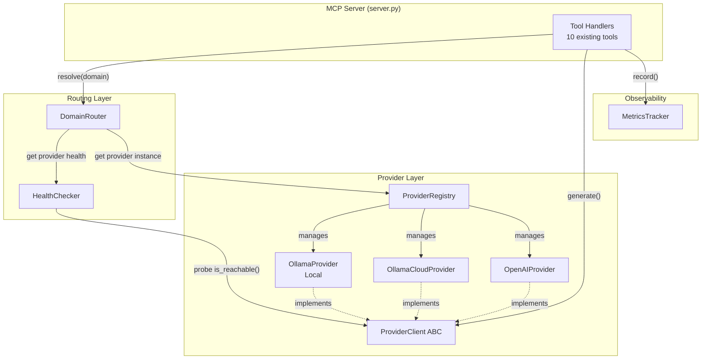

# Design Document: Multi-Provider Workload Offload

## Overview

This design extends the existing Ollama-only domain expert MCP server into a pluggable multi-provider workload offload system. The architecture introduces a provider abstraction layer, a registry for automatic provider discovery, a refactored domain router with health-aware fallback chains, and enhanced metrics tracking — all while preserving the 10 existing MCP tool interfaces unchanged.

The key design principle is **separation of concerns**: providers are defined independently from domain routing. Providers declare *how* to reach an inference backend; routes declare *which* provider and model handles each domain. Health checks and fallback logic sit between routing decisions and provider calls.

### Design Decisions

1. **ABC-based provider interface** — Enables type checking and guarantees all providers satisfy the contract without duck-typing surprises.
2. **Environment-variable-driven configuration** — No config files needed; works well with Docker, systemd, and .env workflows.
3. **Async-first with httpx** — Matches the existing codebase and enables concurrent health probes.
4. **Graceful degradation over hard failures** — The MCP server never crashes due to provider unavailability; it returns structured error responses the orchestrating agent can act on.
5. **Legacy compatibility layer** — Existing `OLLAMA_*` env vars continue working; migration is opt-in.

## Architecture



### Request Flow

1. Tool handler receives MCP call with `domain` parameter
2. `DomainRouter.resolve(domain)` returns `(provider_id, model, options, system_prompt)`
3. If primary provider is unhealthy, router walks the fallback chain
4. Tool handler calls `provider.generate(model, prompt, system, options)`
5. Provider translates to backend-specific HTTP request
6. Response is normalized to `ProviderResponse` dataclass
7. `MetricsTracker` records the delegation event
8. Tool handler formats the response using existing Pydantic models

## Components and Interfaces

### ProviderClient (ABC)

The abstract base class all providers must implement. Lives in `providers/base.py`.

```python
from abc import ABC, abstractmethod
from dataclasses import dataclass
from typing import Optional, Dict, Any, List


@dataclass
class GenerationOptions:
    """Provider-agnostic generation parameters."""
    temperature: float = 0.1
    top_p: float = 0.9
    max_tokens: int = 4096
    system_prompt: Optional[str] = None


@dataclass
class ProviderResponse:
    """Standardized response from any provider."""
    text: str
    model: str
    provider_id: str
    token_count: int
    elapsed_ms: int
    raw: Optional[Dict[str, Any]] = None


class ProviderClient(ABC):
    """Abstract interface for LLM inference providers."""

    @property
    @abstractmethod
    def provider_id(self) -> str:
        """Unique identifier for this provider instance."""
        ...

    @abstractmethod
    async def generate(
        self,
        model: str,
        prompt: str,
        options: Optional[GenerationOptions] = None,
    ) -> ProviderResponse:
        """Generate a completion. Returns standardized response."""
        ...

    @abstractmethod
    async def is_reachable(self) -> bool:
        """Check if the provider endpoint is responsive. Must return within 5s."""
        ...

    @abstractmethod
    async def list_models(self) -> List[str]:
        """Return available model identifiers."""
        ...

    async def close(self) -> None:
        """Clean up resources. Optional override."""
        pass
```

### OllamaProvider (Local)

Lives in `providers/ollama_local.py`. Wraps the existing `OllamaClient` logic.

```python
class OllamaProvider(ProviderClient):
    """Provider for local Ollama instances."""

    def __init__(self, provider_id: str, base_url: str, timeout: float = 120.0):
        self._id = provider_id
        self._base_url = base_url
        self._timeout = timeout
        self._client: Optional[httpx.AsyncClient] = None

    @property
    def provider_id(self) -> str:
        return self._id

    async def generate(self, model, prompt, options=None) -> ProviderResponse:
        # POST /api/generate with {model, prompt, stream: false, options: {temperature, top_p, num_predict}}
        # If options.system_prompt is set, include "system" field
        ...

    async def is_reachable(self) -> bool:
        # GET /api/tags with 5s timeout
        ...

    async def list_models(self) -> List[str]:
        # GET /api/tags → extract model names
        ...
```

**Option translation:** `max_tokens` → `num_predict` in the Ollama `options` dict.

### OllamaCloudProvider

Lives in `providers/ollama_cloud.py`. Inherits from `OllamaProvider`, adds Bearer auth.

```python
class OllamaCloudProvider(OllamaProvider):
    """Provider for Ollama Cloud (authenticated Ollama API)."""

    def __init__(self, provider_id: str, base_url: str, api_key: str, timeout: float = 120.0):
        super().__init__(provider_id, base_url, timeout)
        self._api_key = api_key

    # Override _get_client to add Authorization: Bearer <key> header
    # Override generate to raise descriptive error on 401 responses
```

### OpenAIProvider

Lives in `providers/openai_compat.py`. Implements the OpenAI `/v1/chat/completions` protocol.

```python
class OpenAIProvider(ProviderClient):
    """Provider for OpenAI-compatible APIs (vLLM, Together, Groq, OpenRouter)."""

    def __init__(self, provider_id: str, base_url: str, api_key: str, timeout: float = 120.0):
        self._id = provider_id
        self._base_url = base_url
        self._api_key = api_key
        self._timeout = timeout

    async def generate(self, model, prompt, options=None) -> ProviderResponse:
        # POST /v1/chat/completions
        # Body: {model, messages: [{role: "user", content: prompt}], temperature, max_tokens, top_p}
        # If options.system_prompt: prepend {role: "system", content: system_prompt}
        # Parse response: choices[0].message.content, usage.completion_tokens
        # On HTTP 429: raise with retry_after from Retry-After header
        ...

    async def is_reachable(self) -> bool:
        # GET /v1/models with 5s timeout, auth header
        ...

    async def list_models(self) -> List[str]:
        # GET /v1/models → extract model IDs
        ...
```

**Option translation:** `max_tokens` stays as-is; `top_p` stays; `temperature` stays.

### ProviderRegistry

Lives in `providers/registry.py`. Discovers and manages provider instances from env vars.

```python
class ProviderRegistry:
    """Discovers and manages provider instances from PROVIDER_* env vars."""

    def __init__(self):
        self._providers: Dict[str, ProviderClient] = {}

    def discover(self) -> None:
        """Scan env vars and instantiate providers.

        Patterns:
          PROVIDER_OLLAMA_LOCAL_URL → OllamaProvider("ollama-local", url)
          PROVIDER_OLLAMA_CLOUD_URL + PROVIDER_OLLAMA_CLOUD_API_KEY → OllamaCloudProvider(...)
          PROVIDER_OPENAI_<NAME>_URL + PROVIDER_OPENAI_<NAME>_API_KEY → OpenAIProvider("openai-<name>", ...)
        """
        ...

    def get(self, provider_id: str) -> Optional[ProviderClient]:
        """Get a provider by ID."""
        return self._providers.get(provider_id)

    def list_providers(self) -> Dict[str, ProviderClient]:
        """Return all discovered providers."""
        return dict(self._providers)

    def has(self, provider_id: str) -> bool:
        return provider_id in self._providers

    async def close_all(self) -> None:
        """Close all provider HTTP clients."""
        for p in self._providers.values():
            await p.close()
```

**Provider ID derivation:**
- `PROVIDER_OLLAMA_LOCAL_*` → `"ollama-local"`
- `PROVIDER_OLLAMA_CLOUD_*` → `"ollama-cloud"`
- `PROVIDER_OPENAI_GROQ_*` → `"openai-groq"`
- `PROVIDER_OPENAI_TOGETHER_*` → `"openai-together"`

### DomainRouter (Refactored)

Lives in `routing.py` (replaces `router.py`). Maps domains to providers + models.

```python
@dataclass
class RouteDecision:
    """Complete routing resolution for a domain request."""
    provider_id: str
    model: str
    options: GenerationOptions
    system_prompt: Optional[str] = None


class DomainRouter:
    """Maps domain requests to provider + model using ROUTE_* env vars and health state."""

    def __init__(self, registry: ProviderRegistry, health_checker: "HealthChecker"):
        self._registry = registry
        self._health = health_checker
        self._routes: Dict[str, RouteConfig] = {}
        self._default_provider: Optional[str] = None

    def load_routes(self) -> None:
        """Parse ROUTE_* env vars.

        ROUTE_<DOMAIN>_PROVIDER=<provider-id>
        ROUTE_<DOMAIN>_MODEL=<model-name>
        ROUTE_<DOMAIN>_TEMPERATURE=<float>
        ROUTE_<DOMAIN>_MAX_TOKENS=<int>
        ROUTE_<DOMAIN>_SYSTEM_PROMPT=<text>
        ROUTE_<DOMAIN>_SYSTEM_PROMPT_FILE=<path>
        ROUTE_<DOMAIN>_FALLBACK=<provider-id-1>,<provider-id-2>
        ROUTE_DEFAULT_PROVIDER=<provider-id>
        """
        ...

    def resolve(self, domain: str) -> RouteDecision:
        """Resolve domain to provider+model, respecting health and fallback chain."""
        route = self._routes.get(domain)
        if not route:
            # Use default provider
            ...

        # Check primary health
        if self._health.is_healthy(route.provider_id):
            return RouteDecision(...)

        # Walk fallback chain
        for fallback_id in route.fallback_chain:
            if self._health.is_healthy(fallback_id):
                return RouteDecision(...)

        # Use default provider as last resort
        if self._default_provider and self._health.is_healthy(self._default_provider):
            return RouteDecision(...)

        # No provider available — raise or return sentinel
        raise NoProviderAvailableError(domain)
```

### HealthChecker

Lives in `health.py`. Runs async background probes and maintains provider health state.

```python
@dataclass
class ProviderHealth:
    """Health state for a single provider."""
    provider_id: str
    healthy: bool = True
    consecutive_failures: int = 0
    last_check: Optional[float] = None
    last_latency_ms: Optional[int] = None


class HealthChecker:
    """Async background health probe manager."""

    def __init__(
        self,
        registry: ProviderRegistry,
        interval_seconds: float = 30.0,
        failure_threshold: int = 2,
    ):
        self._registry = registry
        self._interval = interval_seconds
        self._threshold = failure_threshold
        self._state: Dict[str, ProviderHealth] = {}
        self._task: Optional[asyncio.Task] = None

    def is_healthy(self, provider_id: str) -> bool:
        """Check if a provider is currently marked healthy."""
        state = self._state.get(provider_id)
        if state is None:
            return True  # Unknown providers assumed healthy until first probe
        return state.healthy

    async def start(self) -> None:
        """Start the background probe loop."""
        self._task = asyncio.create_task(self._probe_loop())

    async def stop(self) -> None:
        """Stop the background probe loop."""
        if self._task:
            self._task.cancel()

    async def _probe_loop(self) -> None:
        """Periodically probe all providers."""
        while True:
            await self._probe_all()
            await asyncio.sleep(self._interval)

    async def _probe_all(self) -> None:
        """Probe all registered providers concurrently."""
        providers = self._registry.list_providers()
        tasks = [self._probe_one(pid, p) for pid, p in providers.items()]
        await asyncio.gather(*tasks, return_exceptions=True)

    async def _probe_one(self, provider_id: str, provider: ProviderClient) -> None:
        """Probe a single provider and update state."""
        start = time.monotonic()
        reachable = await provider.is_reachable()
        latency_ms = int((time.monotonic() - start) * 1000)

        state = self._state.setdefault(provider_id, ProviderHealth(provider_id=provider_id))
        state.last_check = time.time()
        state.last_latency_ms = latency_ms

        if reachable:
            state.consecutive_failures = 0
            state.healthy = True
        else:
            state.consecutive_failures += 1
            if state.consecutive_failures >= self._threshold:
                state.healthy = False
```

### MetricsTracker (Updated)

Lives in `metrics.py` (refactored). Adds per-provider breakdown and fallback tracking.

```python
class MetricsTracker:
    """Track delegation metrics with per-provider and per-domain breakdown."""

    def record_delegation(
        self,
        domain: str,
        provider_id: str,
        model: str,
        latency_ms: int,
        token_count: int,
        success: bool,
    ) -> None:
        """Record a delegation event, grouped by both domain and provider."""
        ...

    def record_fallback_event(self, domain: str, from_provider: str, to_provider: str) -> None:
        """Record when a fallback was triggered."""
        ...

    def get_provider_metrics(self) -> Dict[str, ProviderMetrics]:
        """Per-provider breakdown: call count, avg latency, success rate, tokens."""
        ...

    def get_domain_metrics(self) -> Dict[str, DomainMetrics]:
        """Per-domain breakdown (backward compatible with current output)."""
        ...

    def get_fallback_counts(self) -> Dict[str, int]:
        """Number of fallback events per domain."""
        ...
```

### Backward Compatibility Layer

Lives in `compat.py`. Detects legacy env vars and synthesizes equivalent new-style config.

```python
class LegacyConfigAdapter:
    """Adapts OLLAMA_* env vars to PROVIDER_*/ROUTE_* format."""

    @staticmethod
    def is_legacy_mode() -> bool:
        """True when OLLAMA_* vars present but no PROVIDER_* vars set."""
        has_legacy = any(k.startswith("OLLAMA_MODEL_") for k in os.environ)
        has_new = any(k.startswith("PROVIDER_") for k in os.environ)
        return has_legacy and not has_new

    @staticmethod
    def synthesize_env_vars() -> Dict[str, str]:
        """Convert legacy OLLAMA_* vars to PROVIDER_*/ROUTE_* equivalents.

        OLLAMA_BASE_URL → PROVIDER_OLLAMA_LOCAL_URL
        OLLAMA_MODEL_<DOMAIN> → ROUTE_<DOMAIN>_MODEL + ROUTE_<DOMAIN>_PROVIDER=ollama-local
        OLLAMA_TEMP_<DOMAIN> → ROUTE_<DOMAIN>_TEMPERATURE
        OLLAMA_MODEL_FALLBACK → ROUTE_DEFAULT_PROVIDER=ollama-local (default model)
        """
        ...
```

### Server.py Changes (Minimal)

The tool handlers change minimally. The key diff in the request flow:

```python
# Before:
model = router.get_model(domain)
options = router.get_generation_options(domain)
result = await client.generate(model=model, prompt=prompt, options=options)

# After:
try:
    route = router.resolve(domain)
    provider = registry.get(route.provider_id)
    response = await provider.generate(
        model=route.model,
        prompt=prompt,
        options=route.options,
    )
    metrics.record_delegation(domain, route.provider_id, route.model, ...)
except NoProviderAvailableError:
    metrics.record_delegation(domain, "none", "", 0, 0, success=False)
    return degradation_response(domain)
```

Each handler gains a `provider_used` field in its response. The existing `model_used` field continues to work.

## Data Models

### New/Updated Pydantic Models

```python
# --- providers/base.py ---

@dataclass
class GenerationOptions:
    temperature: float = 0.1
    top_p: float = 0.9
    max_tokens: int = 4096
    system_prompt: Optional[str] = None


@dataclass
class ProviderResponse:
    text: str
    model: str
    provider_id: str
    token_count: int
    elapsed_ms: int
    raw: Optional[Dict[str, Any]] = None


# --- routing.py ---

@dataclass
class RouteConfig:
    """Parsed route configuration for one domain."""
    domain: str
    provider_id: str
    model: str
    temperature: float = 0.1
    top_p: float = 0.9
    max_tokens: int = 4096
    system_prompt: Optional[str] = None
    fallback_chain: List[str] = field(default_factory=list)


@dataclass
class RouteDecision:
    """Result of resolving a domain to a provider."""
    provider_id: str
    model: str
    options: GenerationOptions
    system_prompt: Optional[str] = None
    is_fallback: bool = False
    fallback_from: Optional[str] = None


# --- health.py ---

@dataclass
class ProviderHealth:
    provider_id: str
    healthy: bool = True
    consecutive_failures: int = 0
    last_check: Optional[float] = None
    last_latency_ms: Optional[int] = None


# --- models.py (updated) ---

class ProviderMetrics(BaseModel):
    """Per-provider metrics."""
    provider_id: str
    call_count: int = 0
    avg_latency_ms: float = 0.0
    total_tokens_generated: int = 0
    success_rate: float = 1.0
    estimated_cost_usd: float = 0.0


class DelegationMetrics(BaseModel):
    """Updated to include per-provider breakdown."""
    total_delegations: int = 0
    total_generation_time_ms: int = 0
    estimated_frontier_tokens_saved: int = 0
    estimated_cost_saved_usd: float = 0.0
    per_domain: Dict[str, DomainMetrics] = Field(default_factory=dict)
    per_provider: Dict[str, ProviderMetrics] = Field(default_factory=dict)
    fallback_events: Dict[str, int] = Field(default_factory=dict)
```

### Environment Variable Schema

| Prefix | Pattern | Example | Purpose |
|--------|---------|---------|---------|
| `PROVIDER_` | `PROVIDER_OLLAMA_LOCAL_URL` | `http://192.168.1.50:11434` | Ollama local endpoint |
| `PROVIDER_` | `PROVIDER_OLLAMA_CLOUD_URL` | `https://cloud.ollama.com` | Ollama cloud endpoint |
| `PROVIDER_` | `PROVIDER_OLLAMA_CLOUD_API_KEY` | `sk-...` | Ollama cloud auth |
| `PROVIDER_` | `PROVIDER_OPENAI_<NAME>_URL` | `https://api.groq.com/openai` | OpenAI-compat endpoint |
| `PROVIDER_` | `PROVIDER_OPENAI_<NAME>_API_KEY` | `gsk_...` | OpenAI-compat auth |
| `ROUTE_` | `ROUTE_<DOMAIN>_PROVIDER` | `ollama-local` | Primary provider for domain |
| `ROUTE_` | `ROUTE_<DOMAIN>_MODEL` | `my-ospf:7b` | Model for domain |
| `ROUTE_` | `ROUTE_<DOMAIN>_TEMPERATURE` | `0.1` | Temperature for domain |
| `ROUTE_` | `ROUTE_<DOMAIN>_MAX_TOKENS` | `4096` | Max tokens for domain |
| `ROUTE_` | `ROUTE_<DOMAIN>_SYSTEM_PROMPT` | `You are an OSPF expert...` | Inline system prompt |
| `ROUTE_` | `ROUTE_<DOMAIN>_SYSTEM_PROMPT_FILE` | `./prompts/ospf.txt` | File-based system prompt |
| `ROUTE_` | `ROUTE_<DOMAIN>_FALLBACK` | `ollama-cloud,openai-groq` | Fallback chain |
| `ROUTE_` | `ROUTE_DEFAULT_PROVIDER` | `ollama-local` | Default provider |
| `HEALTH_` | `HEALTH_CHECK_INTERVAL` | `30` | Probe interval in seconds |
| `HEALTH_` | `HEALTH_FAILURE_THRESHOLD` | `2` | Consecutive failures before unhealthy |

## Correctness Properties

*A property is a characteristic or behavior that should hold true across all valid executions of a system — essentially, a formal statement about what the system should do. Properties serve as the bridge between human-readable specifications and machine-verifiable correctness guarantees.*

### Property 1: Provider response contract

*For any* provider implementation and any valid (model, prompt, options) input, calling `generate` SHALL return a `ProviderResponse` containing non-empty `text`, a positive `token_count`, a non-negative `elapsed_ms`, and the correct `provider_id` and `model` fields matching the inputs.

**Validates: Requirements 1.1, 8.2**

### Property 2: Authentication header inclusion

*For any* request made through the OllamaCloudProvider or OpenAIProvider, the outgoing HTTP request SHALL contain an `Authorization: Bearer <api_key>` header where `<api_key>` matches the configured key.

**Validates: Requirements 3.2, 4.2**

### Property 3: Generation options translation

*For any* `GenerationOptions` instance with arbitrary valid temperature (0.0–2.0), top_p (0.0–1.0), and max_tokens (1–100000), the OllamaProvider SHALL translate `max_tokens` to `num_predict` in the Ollama options dict, and the OpenAIProvider SHALL pass `temperature`, `top_p`, and `max_tokens` directly in the OpenAI request body — with no fields lost or renamed incorrectly.

**Validates: Requirements 2.3, 4.3, 11.4**

### Property 4: OpenAI response parsing round-trip

*For any* valid OpenAI-format response JSON containing `choices[0].message.content` and `usage.completion_tokens`, the OpenAIProvider's parsing logic SHALL produce a `ProviderResponse` where `text` equals the message content and `token_count` equals `completion_tokens`.

**Validates: Requirements 4.4**

### Property 5: Provider discovery completeness

*For any* set of environment variables containing N distinct valid `PROVIDER_*` patterns, the `ProviderRegistry.discover()` method SHALL instantiate exactly N providers, each with a unique `provider_id` derived deterministically from the env var name.

**Validates: Requirements 5.1, 5.2, 5.3, 12.1**

### Property 6: Routing resolution correctness

*For any* domain with a configured `ROUTE_<DOMAIN>_PROVIDER`, `ROUTE_<DOMAIN>_MODEL`, and optional generation parameters, `DomainRouter.resolve(domain)` SHALL return a `RouteDecision` whose `provider_id`, `model`, and `options` fields match the configured values — including system prompts loaded from `ROUTE_<DOMAIN>_SYSTEM_PROMPT` or the file at `ROUTE_<DOMAIN>_SYSTEM_PROMPT_FILE`.

**Validates: Requirements 6.1, 6.2, 6.4, 6.5, 11.1, 11.2, 12.2**

### Property 7: Health state machine transitions

*For any* provider and any sequence of probe results, the `HealthChecker` SHALL mark the provider unhealthy if and only if the number of consecutive failures is ≥ the configured threshold, and SHALL mark it healthy again after a single successful probe following the unhealthy state.

**Validates: Requirements 7.2, 7.3**

### Property 8: Fallback routing under failure

*For any* domain with a configured fallback chain `[P1, P2, P3]` where the primary provider is unhealthy, `DomainRouter.resolve(domain)` SHALL return the first healthy provider in the chain. If no provider in the chain is healthy, it SHALL use `ROUTE_DEFAULT_PROVIDER`. If that is also unhealthy, it SHALL raise `NoProviderAvailableError`.

**Validates: Requirements 7.4, 7.5, 7.6**

### Property 9: Metrics accounting correctness

*For any* sequence of N delegation events with known (domain, provider_id, latency_ms, token_count, success) tuples, the `MetricsTracker` SHALL report: total_delegations = N, per-provider call_count summing to N, per-provider success_rate = successes/total for that provider, and per-domain fallback_events matching the actual fallback event count.

**Validates: Requirements 9.1, 9.2, 9.3, 9.5**

### Property 10: Graceful degradation invariant

*For any* MCP tool call when all configured providers for the requested domain are unreachable, the server SHALL return a valid JSON response with `success: false` and the string `"NO_PROVIDER_AVAILABLE"` in the error message — never an unhandled exception or empty response.

**Validates: Requirements 10.1, 10.2, 10.3**

### Property 11: Route validation at startup

*For any* set of `ROUTE_*` env vars referencing provider IDs, the MCP server SHALL log a warning and skip any route whose `provider_id` does not correspond to a discovered provider — without preventing startup of valid routes.

**Validates: Requirements 12.3, 12.4**

### Property 12: Legacy env var backward compatibility

*For any* configuration containing only `OLLAMA_BASE_URL` and `OLLAMA_MODEL_*` vars (no `PROVIDER_*` vars), the `LegacyConfigAdapter` SHALL synthesize equivalent `PROVIDER_OLLAMA_LOCAL_URL` and `ROUTE_*` vars such that the system routes identically to the current implementation.

**Validates: Requirements 13.1, 13.2**

## Error Handling

### Error Categories

| Error | Source | Handling |
|-------|--------|----------|
| Provider unreachable | `is_reachable()` timeout | Mark unhealthy, try fallback chain |
| Mid-request failure | `generate()` raises `httpx.ConnectError` | Try next fallback, then degrade |
| Auth failure (401) | OllamaCloud/OpenAI response | Raise `ProviderAuthError` with descriptive message, mark unhealthy |
| Rate limit (429) | OpenAI response | Raise `ProviderRateLimitError` with `retry_after`, try fallback |
| Invalid model | Provider returns 404 on model | Return `success: false` with model-not-found message |
| All providers down | `NoProviderAvailableError` | Return degradation response with `NO_PROVIDER_AVAILABLE` |
| Invalid route config | Route references missing provider | Log warning, skip route (don't crash) |
| Legacy + new conflict | Both env var styles detected | Log deprecation, prefer new-style |

### Error Response Structure

All error responses preserve the existing JSON structure with `success: false`:

```json
{
  "success": false,
  "domain": "ospf",
  "model_used": "",
  "provider_used": "",
  "config": "",
  "warnings": [
    "NO_PROVIDER_AVAILABLE: All providers for domain 'ospf' are unreachable. Orchestrator should handle this task directly."
  ],
  "generation_time_ms": 0,
  "estimated_tokens": 0
}
```

### Retry Strategy

- **No automatic retries within a single provider** — if `generate()` fails, move to next fallback immediately
- **Fallback chain is the retry mechanism** — each provider in the chain gets one attempt
- **Health checker provides circuit-breaker** — unhealthy providers are skipped without attempting a request

## Testing Strategy

### Property-Based Tests (Hypothesis)

The project will use **Hypothesis** (Python's standard PBT library) for property-based testing. Each correctness property maps to a single property test with minimum 100 iterations.

**Library:** `hypothesis` (already available in Python ecosystem, install with `pip install hypothesis`)

**Configuration:**
- Minimum 100 examples per property (`@settings(max_examples=100)`)
- Deadline of 5 seconds per example for non-network tests
- Suppress health checks for tests using mocked I/O

**Property test targets:**
- `providers/base.py` — response contract validation
- `providers/ollama_local.py` — options translation (mocked HTTP)
- `providers/ollama_cloud.py` — auth header presence (mocked HTTP)
- `providers/openai_compat.py` — options mapping + response parsing
- `providers/registry.py` — discovery completeness, ID uniqueness
- `routing.py` — resolution correctness, fallback logic
- `health.py` — state machine transitions
- `metrics.py` — accounting correctness
- `compat.py` — legacy env var translation

**Tag format:** Each property test will include a docstring comment:
```python
# Feature: multi-provider-workload-offload, Property 3: Generation options translation
```

### Unit Tests (pytest)

Example-based unit tests for:
- Specific env var parsing scenarios (each provider type)
- 401/429 error handling edge cases
- Legacy mode detection
- Degradation response format
- Health check timeout behavior (5s requirement)

### Integration Tests

- Start real Ollama instance (if available in CI) and verify end-to-end generate flow
- Mock HTTP server simulating OpenAI responses for full tool handler flow
- Verify all 10 MCP tool definitions unchanged (schema snapshot test)

### Test File Structure

```
tests/
├── conftest.py              # Shared fixtures (mock providers, env var helpers)
├── test_providers/
│   ├── test_ollama_local.py
│   ├── test_ollama_cloud.py
│   ├── test_openai_compat.py
│   └── test_registry.py
├── test_routing.py
├── test_health.py
├── test_metrics.py
├── test_compat.py
├── test_degradation.py
└── test_tool_schemas.py     # Snapshot: tool names + schemas unchanged
```

## File Structure

### New Files

```
mcp-servers/ollama-mcp/
├── providers/
│   ├── __init__.py          # Exports ProviderClient, ProviderResponse, GenerationOptions
│   ├── base.py              # ABC + dataclasses
│   ├── ollama_local.py      # OllamaProvider
│   ├── ollama_cloud.py      # OllamaCloudProvider (extends OllamaProvider)
│   ├── openai_compat.py     # OpenAIProvider
│   └── registry.py          # ProviderRegistry
├── routing.py               # New DomainRouter with health-aware fallback
├── health.py                # HealthChecker with async background probes
├── compat.py                # LegacyConfigAdapter
└── tests/                   # Test suite (structure above)
```

### Refactored Files

| File | Change |
|------|--------|
| `server.py` | Replace `client`/`router` globals with `registry`/`router`/`health_checker`. Update handlers to use `router.resolve()` → `provider.generate()`. Add `provider_used` to responses. |
| `metrics.py` | Add `provider_id` param to `record_delegation()`, add `per_provider` dict, add `record_fallback_event()`. |
| `models.py` | Add `ProviderMetrics` model, update `DelegationMetrics` with `per_provider` and `fallback_events` fields. Add `provider_used` field to response models. |

### Removed/Deprecated Files

| File | Action |
|------|--------|
| `router.py` | Replaced by `routing.py`. Keep for one release with import redirect + deprecation warning. |
| `ollama_client.py` | Functionality absorbed into `providers/ollama_local.py`. Keep for one release as thin wrapper. |

