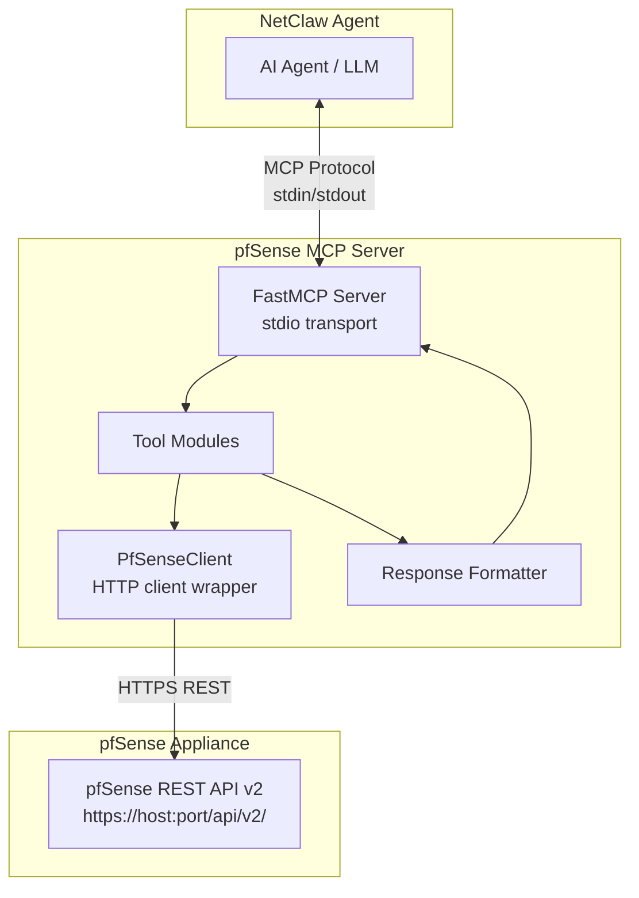

# Design Document: pfSense MCP Server

## Overview

The pfSense MCP Server is a Python-based Model Context Protocol server that exposes pfSense firewall management capabilities to the NetClaw agent over stdio transport. It wraps the pfSense REST API v2 (pfrest package) into a set of well-defined MCP tools, enabling AI-assisted network engineering workflows including firewall rule management, diagnostics, monitoring, and configuration backup.

### Key Design Decisions

1. **FastMCP framework**: Uses the `fastmcp` (or `mcp` SDK's `FastMCP`) library consistent with other NetClaw MCP servers for rapid tool definition via decorators.
2. **pfSense REST API v2**: Targets the pfrest package (`/api/v2/`) rather than the legacy XML-RPC interface. The REST API provides 200+ endpoints with consistent JSON responses and proper HTTP status codes.
3. **API Key authentication**: Supports both Basic Auth (username/password) and API Key (`X-API-Key` header) authentication methods. JWT is omitted from initial implementation due to token refresh complexity.
4. **Apply-after-write pattern**: Firewall, NAT, and interface changes require a separate POST to an `/apply` endpoint to activate. The server handles this transparently after successful mutations.
5. **Single-instance default, multi-instance capable**: Environment variables configure a default pfSense target, but each tool accepts an optional `target` parameter to address different appliances.
6. **Self-signed certificate support**: pfSense commonly uses self-signed TLS certs. An environment variable (`PFSENSE_VERIFY_TLS=false`) disables certificate verification.

## Architecture



### Layered Architecture

1. **Transport Layer** — FastMCP handles MCP protocol framing over stdio (stdin/stdout). Logging goes to stderr.
2. **Tool Layer** — Individual tool functions decorated with `@mcp.tool()`. Each tool maps to one or more pfSense API operations.
3. **Client Layer** — A `PfSenseClient` class encapsulates HTTP communication, authentication, TLS handling, timeouts, and error normalization.
4. **Response Layer** — A formatter module ensures all responses follow the consistent JSON structure defined in Requirement 15.

## Components and Interfaces

### PfSenseClient

The core HTTP client that manages communication with pfSense REST API v2.

```python
class PfSenseClient:
    """HTTP client for pfSense REST API v2 with auth and error handling."""

    def __init__(self, host: str, api_key: str = None, username: str = None,
                 password: str = None, verify_tls: bool = True, timeout: int = 30):
        ...

    def get(self, path: str, params: dict = None) -> dict:
        """GET request to pfSense API. Returns parsed JSON response."""
        ...

    def post(self, path: str, data: dict = None) -> dict:
        """POST request to pfSense API. Returns parsed JSON response."""
        ...

    def put(self, path: str, data: dict = None) -> dict:
        """PUT request to pfSense API. Returns parsed JSON response."""
        ...

    def patch(self, path: str, data: dict = None) -> dict:
        """PATCH request to pfSense API. Returns parsed JSON response."""
        ...

    def delete(self, path: str, params: dict = None) -> dict:
        """DELETE request to pfSense API. Returns parsed JSON response."""
        ...

    def apply(self, subsystem: str) -> dict:
        """POST to the apply endpoint for a subsystem (firewall, nat, interface)."""
        ...
```

### Tool Modules

Tools are organized by domain, each in its own module file:

| Module | Tools | pfSense API Endpoints |
|--------|-------|-----------------------|
| `tools/firewall.py` | `list_firewall_rules`, `add_firewall_rule`, `modify_firewall_rule`, `delete_firewall_rule` | `/api/v2/firewall/rules`, `/api/v2/firewall/rule`, `/api/v2/firewall/apply` |
| `tools/nat.py` | `list_nat_rules`, `add_nat_rule`, `delete_nat_rule` | `/api/v2/firewall/nat/port_forward`, `/api/v2/firewall/nat/one_to_one/mapping`, `/api/v2/firewall/nat/outbound/mapping` |
| `tools/interfaces.py` | `list_interfaces`, `get_interface_status`, `update_interface`, `create_vlan` | `/api/v2/interfaces`, `/api/v2/interface`, `/api/v2/interface/vlan` |
| `tools/dns.py` | `get_dns_config`, `modify_dns_resolver`, `list_dns_host_overrides`, `add_dns_host_override`, `delete_dns_host_override`, `list_dns_domain_overrides` | `/api/v2/services/dns_resolver/settings`, `/api/v2/services/dns_resolver/host_override`, `/api/v2/services/dns_resolver/domain_override` |
| `tools/dhcp.py` | `get_dhcp_config`, `list_dhcp_leases`, `list_dhcp_static_mappings`, `add_dhcp_static_mapping` | `/api/v2/services/dhcp_server`, `/api/v2/services/dhcp_server/static_mapping` |
| `tools/logs.py` | `get_system_logs`, `get_filter_logs` | `/api/v2/status/logs/system`, `/api/v2/status/logs/firewall` |
| `tools/diagnostics.py` | `ping`, `traceroute`, `dns_lookup`, `get_arp_table`, `get_routing_table`, `get_connection_states` | `/api/v2/diagnostics/ping`, `/api/v2/diagnostics/arp_table` |
| `tools/gateways.py` | `get_gateways`, `get_gateway_groups` | `/api/v2/status/gateways` |
| `tools/services.py` | `list_services`, `restart_service`, `stop_service`, `start_service` | `/api/v2/status/services` |
| `tools/config.py` | `backup_config`, `list_config_history`, `restore_config` | `/api/v2/diagnostics/config_history/revisions` |
| `tools/vpn.py` | `get_ipsec_status`, `get_openvpn_status`, `disconnect_openvpn_client` | `/api/v2/status/ipsec/sas`, `/api/v2/status/openvpn/servers` |
| `tools/system.py` | `get_system_info`, `get_installed_packages`, `get_available_updates` | `/api/v2/status/system`, `/api/v2/system/packages`, `/api/v2/system/update` |
| `tools/traffic.py` | `get_interface_traffic`, `get_top_talkers` | `/api/v2/status/interfaces`, `/api/v2/firewall/states` |

### Response Formatter

```python
def format_success(data: dict, resource_type: str = None) -> str:
    """Format a successful response as JSON string with snake_case fields."""
    ...

def format_error(tool_name: str, message: str, hint: str = None,
                 resource_type: str = None, identifier: str = None,
                 valid_identifiers: list = None) -> str:
    """Format an error response with remediation hints."""
    ...

def format_write_success(resource: dict) -> str:
    """Format a write operation success with success=true and resource state."""
    ...
```

### Configuration & Environment Variables

| Variable | Required | Description | Default |
|----------|----------|-------------|---------|
| `PFSENSE_HOST` | Yes | pfSense host URL (e.g., `https://192.168.3.1:440`) | — |
| `PFSENSE_API_KEY` | Conditional | API key for X-API-Key auth | — |
| `PFSENSE_USERNAME` | Conditional | Username for Basic Auth | — |
| `PFSENSE_PASSWORD` | Conditional | Password for Basic Auth | — |
| `PFSENSE_VERIFY_TLS` | No | Set to `false` to skip TLS verification | `true` |
| `PFSENSE_TIMEOUT` | No | Request timeout in seconds | `30` |

Either `PFSENSE_API_KEY` or both `PFSENSE_USERNAME` and `PFSENSE_PASSWORD` must be provided.

### Multi-Instance Support

For managing multiple pfSense appliances, additional instances are configured via environment variables with a prefix pattern:

```
PFSENSE_<ALIAS>_HOST=https://10.0.0.1:443
PFSENSE_<ALIAS>_API_KEY=...
```

Each tool accepts an optional `target` parameter (alias name). If omitted, the default (unprefixed) credentials are used.

## Data Models

### Firewall Rule

```python
@dataclass
class FirewallRule:
    interface: str          # Interface name (e.g., "wan", "lan")
    action: str             # "pass", "block", or "reject"
    protocol: str           # "tcp", "udp", "icmp", "any", etc.
    source: str             # IP/CIDR or "any"
    source_port: str | None # Port or port range, or None
    destination: str        # IP/CIDR or "any"
    destination_port: str | None  # Port or port range, or None
    description: str        # Human-readable description
    position: int           # Position index in the ruleset
    enabled: bool           # Whether the rule is active
    direction: str          # "in" or "out"
    log: bool               # Whether to log matched packets
```

### NAT Rule

```python
@dataclass
class NatRule:
    nat_type: str           # "port_forward", "one_to_one", "outbound"
    interface: str          # Interface name
    protocol: str           # "tcp", "udp", "tcp/udp"
    source: str             # Source address/network
    destination: str        # Original destination
    redirect_target: str    # Redirect target IP
    redirect_port: str | None  # Redirect target port
    description: str
    enabled: bool
    id: str                 # Unique rule identifier from pfSense
```

### Interface Info

```python
@dataclass
class InterfaceInfo:
    name: str               # Logical name (e.g., "wan", "lan", "opt1")
    description: str        # User-assigned description
    ip_address: str | None  # IPv4 address
    subnet_mask: int | None # CIDR prefix length
    status: str             # "up", "down", or "disabled"
    mac_address: str
    media_type: str         # e.g., "1000baseT <full-duplex>"
    bytes_in: int
    bytes_out: int
    packets_in: int
    packets_out: int
    errors_in: int
    errors_out: int
    link_state: str         # "up" or "down"
```

### Gateway Status

```python
@dataclass
class GatewayStatus:
    name: str               # Gateway name
    gateway_ip: str         # Gateway IP address
    interface: str          # Associated interface
    monitor_ip: str         # IP used for monitoring
    rtt_ms: float           # Round-trip time in milliseconds
    packet_loss_pct: float  # Packet loss percentage (0.0-100.0)
    status: str             # "online", "degraded", "offline", "unknown"
```

### DNS Host Override

```python
@dataclass
class DnsHostOverride:
    hostname: str           # Host portion (e.g., "server1")
    domain: str             # Domain portion (e.g., "example.com")
    ip_address: str         # Target IP address
    description: str
```

### DHCP Lease

```python
@dataclass
class DhcpLease:
    ip_address: str
    mac_address: str
    hostname: str | None
    lease_start: str        # ISO 8601 timestamp
    lease_end: str          # ISO 8601 timestamp
```

### Service Info

```python
@dataclass
class ServiceInfo:
    name: str               # Service identifier (e.g., "unbound", "dhcpd")
    description: str        # Human-readable name
    status: str             # "running" or "stopped"
```

### Error Response

```python
@dataclass
class ErrorResponse:
    tool_name: str          # The MCP tool that was invoked
    error: str              # Error message from pfSense or validation
    hint: str               # Remediation suggestion
    resource_type: str | None  # Type of resource (if applicable)
    identifier: str | None     # The identifier that was not found
    valid_identifiers: list[str] | None  # Valid options (if < 50)
```

### Write Success Response

```python
@dataclass
class WriteSuccessResponse:
    success: bool           # Always True for successful writes
    resource: dict          # The resulting state of the modified resource
```

## Correctness Properties

*A property is a characteristic or behavior that should hold true across all valid executions of a system—essentially, a formal statement about what the system should do. Properties serve as the bridge between human-readable specifications and machine-verifiable correctness guarantees.*

### Property 1: Authentication error credential exclusion

*For any* authentication failure where arbitrary credentials (username, password, or API key) are provided, the error message returned by the MCP server SHALL contain the target hostname and a failure reason but SHALL NOT contain any substring matching the credential values.

**Validates: Requirements 1.2**

### Property 2: Multi-instance alias resolution

*For any* set of configured pfSense instance aliases with distinct host/credential mappings, resolving a given alias SHALL always return the exact host URL and credentials associated with that alias, and resolving a non-existent alias SHALL return an error.

**Validates: Requirements 1.3**

### Property 3: Missing environment variable identification

*For any* subset of required environment variables that are missing or empty at startup, the startup error message SHALL identify every missing variable by name, and no required variable that IS present shall appear in the error.

**Validates: Requirements 1.6**

### Property 4: List response field completeness

*For any* list/get response from any tool (firewall rules, NAT rules, interfaces, DNS host overrides, DHCP leases, filter logs, gateways), every item in the response SHALL contain all fields specified in the requirements for that resource type, with no required fields omitted.

**Validates: Requirements 2.1, 3.1, 4.1, 5.3, 6.2, 7.2, 9.1**

### Property 5: Apply-after-write for stateful subsystems

*For any* successful write operation (create, modify, delete) targeting firewall rules, NAT rules, or interface configurations, the server SHALL invoke the corresponding apply endpoint after the mutation, ensuring changes are activated.

**Validates: Requirements 2.2, 2.3, 2.4, 2.5, 3.2, 3.3, 3.4, 4.3**

### Property 6: Invalid resource identifier error format

*For any* tool invocation referencing a non-existent resource (interface, service, gateway, rule), the error response SHALL contain the resource type, the invalid identifier that was provided, and a list of valid identifiers when fewer than 50 exist.

**Validates: Requirements 2.6, 3.6, 4.6, 10.6, 14.3, 15.2**

### Property 7: Parameter validation error format

*For any* request containing an invalid parameter value (unrecognized protocol, malformed IP, out-of-range port, invalid VLAN tag), the error response SHALL identify the parameter name, the expected type or format, and the value that was received.

**Validates: Requirements 2.7, 3.5, 4.7, 15.5**

### Property 8: Log filtering correctness

*For any* set of log entries and any filter criteria (text substring, source IP, destination IP, interface, action, or protocol), every entry in the filtered result SHALL match all applied filter criteria, and no matching entry from the original set SHALL be excluded.

**Validates: Requirements 7.4, 7.5**

### Property 9: Result set bounded size and ordering

*For any* query that specifies a result limit (log line count 1–10000, connection states max 1000, config history max 100, top talkers max 100), the returned set SHALL contain at most the specified maximum number of entries. For config history, entries SHALL be ordered newest-first. For top talkers, entries SHALL be ordered by bandwidth descending.

**Validates: Requirements 7.3, 8.6, 11.2, 14.2**

### Property 10: Gateway status classification

*For any* gateway metrics returned by the pfSense API, the server SHALL classify the gateway status as exactly one of: "online", "degraded", "offline", or "unknown". A gateway with packet loss exceeding its configured threshold SHALL always be classified as "degraded" or "offline" (never "online").

**Validates: Requirements 9.2, 9.4**

### Property 11: Critical service operation warning

*For any* stop or restart request targeting a service in the critical set (sshd, webgui), the response SHALL include a warning about potential loss of management access, regardless of whether the operation succeeds or fails.

**Validates: Requirements 10.5**

### Property 12: snake_case response formatting

*For any* successful JSON response from any tool, all field names at every nesting level SHALL conform to snake_case naming (matching the pattern `^[a-z][a-z0-9]*(_[a-z0-9]+)*$`).

**Validates: Requirements 15.3**

### Property 13: Write success response structure

*For any* successful write operation (create, modify, delete) on any resource type, the response SHALL contain a `success` field set to `true` and a `resource` field containing the resulting state of the modified resource.

**Validates: Requirements 15.4**

### Property 14: API error response structure

*For any* error response originating from the pfSense API, the MCP server SHALL return a structured error containing the `tool_name` that was invoked, the `error` message from pfSense, and a `hint` field with a human-readable remediation suggestion.

**Validates: Requirements 15.1**

## Error Handling

### Error Categories

| Category | HTTP Status | Handling |
|----------|-------------|----------|
| Authentication failure | 401, 403 | Return auth error with hostname, no credentials in output |
| Resource not found | 404 | Return error with resource type, identifier, valid options |
| Validation error | 400 | Return error with field name, expected format, received value |
| Timeout | — (no response) | Return timeout error with target and elapsed duration |
| Service unavailable | 502, 503 | Return error indicating pfSense service issue |
| Configuration conflict | 409 | Return error indicating the conflict (duplicate entry, etc.) |

### Error Response Construction

All errors flow through the `format_error()` function which ensures consistent structure:

```python
{
    "tool_name": "add_firewall_rule",
    "error": "Invalid protocol: 'xyz' is not a recognized protocol",
    "hint": "Accepted protocols: tcp, udp, icmp, any, tcp/udp, carp, pfsync",
    "parameter": "protocol",
    "expected": "one of: tcp, udp, icmp, any, tcp/udp, carp, pfsync",
    "received": "xyz"
}
```

### Safety Guards

1. **Management IP protection**: Before applying interface changes, check if the change would remove the IP address used for API communication. Reject with a clear warning.
2. **Critical service warnings**: Before stopping/restarting sshd or webgui, include a warning but proceed (the engineer may be accessing via console).
3. **Pre-restore backup**: Always create a configuration backup before restoring an older revision. Include the backup revision ID in the response for recovery.
4. **Credential sanitization**: Never include credential values (password, API key) in any error message or log output.

### Timeout Handling

- Default timeout: 30 seconds for all API calls
- Configurable via `PFSENSE_TIMEOUT` environment variable
- Diagnostic operations (ping, traceroute) use their own timeouts defined by the operation parameters
- On timeout: return structured error with target host and elapsed duration

## Testing Strategy

### Property-Based Testing

This feature is well-suited for property-based testing in several areas:
- **Response formatting**: Verifying structural properties of all responses (field presence, naming conventions, bounded sizes)
- **Input validation**: Testing that invalid inputs are correctly rejected with proper error formatting
- **Filtering logic**: Verifying that log/state filters correctly include/exclude entries
- **Error formatting**: Ensuring error responses always contain required fields regardless of the error source

**PBT Library**: [Hypothesis](https://hypothesis.readthedocs.io/) for Python

**Configuration**: Minimum 100 iterations per property test.

**Tag format**: `Feature: pfsense-mcp-server, Property {number}: {property_text}`

### Unit Tests (Example-Based)

Unit tests cover specific scenarios using mocked API responses:

| Area | Tests |
|------|-------|
| Authentication | Valid auth succeeds, invalid auth returns proper error, missing env vars detected |
| Firewall CRUD | Add rule with all fields, modify single field, delete by position |
| NAT CRUD | Add port forward, delete by ID |
| Interface | List interfaces, create VLAN with valid tag, reject management IP change |
| DNS | Add host override, detect duplicate, delete by hostname+domain |
| DHCP | List leases, add static mapping, detect IP conflict |
| Logs | Query by type, filter by text, respect line count limit |
| Diagnostics | Ping success/failure, traceroute formatting, ARP table parsing |
| Gateways | Status classification for various metric combinations |
| Services | Start/stop/restart, critical service warning, idempotent operations |
| Config | Backup retrieval, history listing, restore with pre-backup |
| VPN | IPsec/OpenVPN status parsing, disconnect client |
| System | System info with missing metrics, package listing |
| Traffic | Interface throughput, top talkers sorting |

### Integration Tests

Integration tests run against a real or test pfSense instance:

- End-to-end firewall rule lifecycle (create → verify → modify → verify → delete → verify)
- DNS host override lifecycle
- DHCP static mapping lifecycle
- Diagnostic command execution (ping, traceroute, DNS lookup)
- Configuration backup and restore cycle
- Service stop/start cycle

### Test Organization

```
tests/
├── unit/
│   ├── test_client.py          # PfSenseClient HTTP behavior
│   ├── test_formatter.py       # Response/error formatting
│   ├── test_validation.py      # Input validation logic
│   ├── test_firewall.py        # Firewall tool logic
│   ├── test_nat.py             # NAT tool logic
│   ├── test_interfaces.py      # Interface tool logic
│   ├── test_dns.py             # DNS tool logic
│   ├── test_dhcp.py            # DHCP tool logic
│   ├── test_logs.py            # Log tool logic
│   ├── test_diagnostics.py     # Diagnostics tool logic
│   ├── test_gateways.py        # Gateway tool logic
│   ├── test_services.py        # Service tool logic
│   ├── test_config.py          # Config backup/restore logic
│   ├── test_vpn.py             # VPN tool logic
│   ├── test_system.py          # System info tool logic
│   └── test_traffic.py         # Traffic tool logic
├── property/
│   ├── test_response_format.py # Properties 12, 13, 14
│   ├── test_validation.py      # Properties 3, 7
│   ├── test_error_format.py    # Properties 1, 6
│   ├── test_filtering.py       # Properties 8, 9
│   ├── test_resolution.py      # Property 2
│   ├── test_completeness.py    # Property 4
│   ├── test_apply_pattern.py   # Property 5
│   ├── test_gateway_status.py  # Property 10
│   └── test_service_warning.py # Property 11
└── integration/
    ├── test_firewall_lifecycle.py
    ├── test_dns_lifecycle.py
    ├── test_diagnostics.py
    └── test_config_lifecycle.py
```

### Dependencies

```
mcp>=1.4.0
requests>=2.31.0
python-dotenv>=1.0.0
hypothesis>=6.100.0  # Property-based testing
pytest>=8.0.0
pytest-mock>=3.12.0
```

