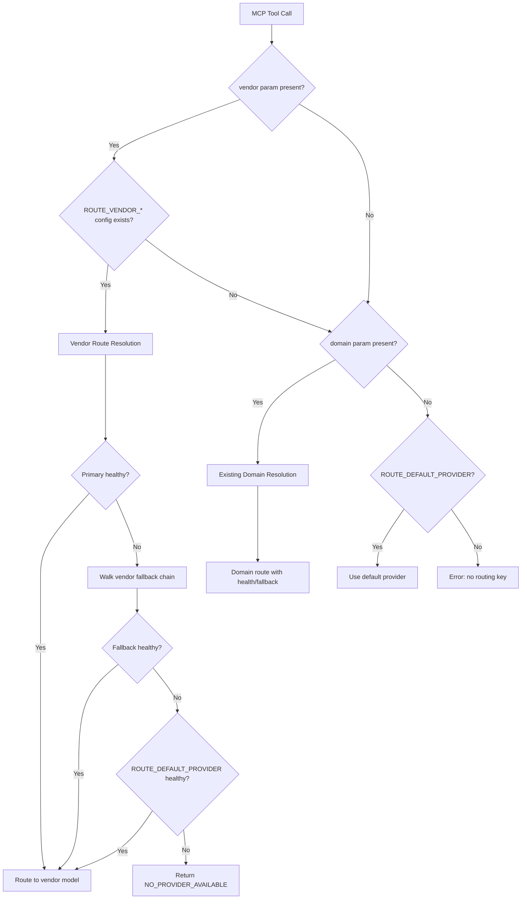

# Design Document: Vendor-Specific Delegation

## Overview

This feature extends the existing domain-based routing in the ollama-mcp server to support vendor-specific model routing. The key insight is that the orchestrating agent already knows the target device vendor from pyATS testbed or Nautobot platform data, so the routing system can leverage this to dispatch requests directly to distilled 7B models trained as vendor specialists (netclaw-cisco:7b, netclaw-arista:7b, etc.).

Vendor routing is additive — it coexists with existing domain routing through a clear precedence order: vendor route → domain route → default provider. This allows gradual migration from ~20 ROUTE_* variables to ~5 ROUTE_VENDOR_* variables.

Distilled models carry CLI syntax knowledge in their weights, enabling lighter prompts (no system prompts or output format directives needed), which reduces token usage and latency.

## Architecture

The design extends the existing `DomainRouter` class with a `VendorRouter` mixin/subclass rather than replacing it. The vendor routing layer slots in above domain routing in the resolution chain.



### Key Design Decisions

1. **Extend DomainRouter rather than create separate class** — Vendor routing reuses the same health checking, fallback chain mechanics, and provider registry. A single router with dual resolution paths avoids duplication and keeps the startup sequence simple.

2. **Vendor takes priority over domain** — When both are supplied, vendor routing wins. This is unambiguous and matches the intent: if the orchestrator knows the vendor, it wants the vendor specialist regardless of what protocol domain applies.

3. **No fall-through from vendor to domain** — If a vendor route exists but all providers are unhealthy, the system returns `NO_PROVIDER_AVAILABLE` rather than trying domain routing. This prevents surprising behavior where a vendor-specialist request silently degrades to a generic domain model.

4. **Prompt construction adapts per route type** — Vendor-routed prompts omit system prompts and format directives since distilled models don't need them. This is handled at the prompt builder level by checking the route type.

## Components and Interfaces

### VendorRouteConfig (dataclass)

```python
@dataclass
class VendorRouteConfig:
    vendor: str                           # normalized lowercase: cisco, arista, etc.
    provider_id: str                      # from ROUTE_VENDOR_<V>_PROVIDER
    model: str                            # from ROUTE_VENDOR_<V>_MODEL
    temperature: float = 0.1             # from ROUTE_VENDOR_<V>_TEMPERATURE
    max_tokens: int = 4096               # from ROUTE_VENDOR_<V>_MAX_TOKENS
    system_prompt: Optional[str] = None  # from ROUTE_VENDOR_<V>_SYSTEM_PROMPT (override only)
    fallback_chain: List[str] = field(default_factory=list)  # from ROUTE_VENDOR_<V>_FALLBACK
```

### Extended DomainRouter

The `DomainRouter` class gains:

- `_vendor_routes: Dict[str, VendorRouteConfig]` — vendor route table
- `load_vendor_routes()` — scans ROUTE_VENDOR_* env vars
- `resolve_vendor(vendor: str) -> RouteDecision` — health-aware vendor resolution
- Updated `resolve()` → `resolve(domain: str = None, vendor: str = None, platform: str = None)` — unified entry point with precedence logic

### RouteDecision extension

```python
@dataclass
class RouteDecision:
    provider_id: str
    model: str
    options: GenerationOptions
    system_prompt: Optional[str] = None
    is_fallback: bool = False
    fallback_from: Optional[str] = None
    route_type: str = "domain"       # NEW: "vendor" | "domain" | "default"
    vendor: Optional[str] = None     # NEW: vendor name if vendor-routed
    platform: Optional[str] = None   # NEW: platform passed through
```

### Prompt Builder Changes

A new `build_vendor_prompt()` function (or conditional path in existing builders) that:
- Omits system prompt unless `ROUTE_VENDOR_<V>_SYSTEM_PROMPT` override is set
- Prepends `Platform: <value>` line when platform is provided
- Omits output format directives ("Generate ONLY the configuration block...")
- Retains device context fields (hostname, interfaces, router_id, ASN) with identical formatting

### MCP Tool Schema Changes

Four tools gain optional `vendor` and `platform` properties:
- `ollama_generate_config`
- `ollama_validate_design`
- `ollama_domain_query`
- `ollama_validate_config_against_sot`

Schema validation changes:
- `domain` becomes optional when `vendor` is present
- At least one of `vendor` or `domain` must be provided (custom validation)
- `platform` is optional string, max 32 characters

### MetricsTracker Extension

- New `per_vendor: Dict[str, VendorMetrics]` field in `DelegationMetrics`
- New `vendor_fallback_events: Dict[str, int]` (keyed by vendor name)
- New `vendor_routed_count: int` and `domain_routed_count: int` running totals
- `record_delegation()` gains optional `vendor` param
- `ollama_delegation_stats` output includes vendor breakdown when data exists

### SUPPORTED_VENDORS constant

```python
SUPPORTED_VENDORS = frozenset({"cisco", "arista", "juniper", "paloalto", "f5"})
```

Used for input validation. Case-insensitive — normalize to lowercase before lookup.

## Data Models

### New Pydantic Models

```python
class VendorMetrics(BaseModel):
    """Per-vendor metrics breakdown."""
    vendor: str
    call_count: int = 0
    avg_latency_ms: float = 0.0
    total_tokens_generated: int = 0
    success_rate: float = 1.0
```

### Extended DelegationMetrics

```python
class DelegationMetrics(BaseModel):
    # ... existing fields ...
    per_vendor: Dict[str, VendorMetrics] = Field(default_factory=dict)
    vendor_fallback_events: Dict[str, int] = Field(default_factory=dict)
    vendor_routed_count: int = 0
    domain_routed_count: int = 0
```

### Input Validation Model

```python
class RoutingInput(BaseModel):
    """Validated routing parameters extracted from tool call arguments."""
    vendor: Optional[str] = None       # normalized lowercase
    platform: Optional[str] = None     # max 32 chars
    domain: Optional[str] = None       # existing domain key

    @model_validator(mode='after')
    def at_least_one_routing_key(self) -> 'RoutingInput':
        if not self.vendor and not self.domain:
            raise ValueError("At least one routing key (vendor or domain) is required")
        return self

    @field_validator('vendor')
    @classmethod
    def validate_vendor(cls, v):
        if v is not None:
            v = v.lower().strip()
            if v not in SUPPORTED_VENDORS:
                raise ValueError(
                    f"Unsupported vendor '{v}'. Valid: {sorted(SUPPORTED_VENDORS)}"
                )
        return v

    @field_validator('platform')
    @classmethod
    def validate_platform(cls, v):
        if v is not None:
            if not v.strip() or len(v) > 32:
                raise ValueError("Platform must be non-empty and <= 32 characters")
        return v
```

### Environment Variable Patterns

| Pattern | Example | Purpose |
|---------|---------|---------|
| `ROUTE_VENDOR_<V>_PROVIDER` | `ROUTE_VENDOR_CISCO_PROVIDER=ollama-cloud` | Primary provider |
| `ROUTE_VENDOR_<V>_MODEL` | `ROUTE_VENDOR_CISCO_MODEL=netclaw-cisco:7b` | Model name |
| `ROUTE_VENDOR_<V>_TEMPERATURE` | `ROUTE_VENDOR_CISCO_TEMPERATURE=0.1` | Optional, 0.0–2.0 |
| `ROUTE_VENDOR_<V>_MAX_TOKENS` | `ROUTE_VENDOR_CISCO_MAX_TOKENS=4096` | Optional, 1–1000000 |
| `ROUTE_VENDOR_<V>_FALLBACK` | `ROUTE_VENDOR_CISCO_FALLBACK=ollama-local,openai-gpt4` | Max 5 entries |
| `ROUTE_VENDOR_<V>_SYSTEM_PROMPT` | `ROUTE_VENDOR_CISCO_SYSTEM_PROMPT=...` | Override only |
| `ROUTE_VENDOR_<V>_SYSTEM_PROMPT_FILE` | `ROUTE_VENDOR_CISCO_SYSTEM_PROMPT_FILE=/path` | File-based override |


## Correctness Properties

*A property is a characteristic or behavior that should hold true across all valid executions of a system — essentially, a formal statement about what the system should do. Properties serve as the bridge between human-readable specifications and machine-verifiable correctness guarantees.*

### Property 1: Vendor Input Validation

*For any* string input as a vendor parameter, the system SHALL accept it if and only if its lowercase-normalized form is in the set {cisco, arista, juniper, paloalto, f5}. Accepted values SHALL be stored as their lowercase normalization. Rejected values SHALL produce an error listing the valid vendor set.

**Validates: Requirements 1.1, 1.6**

### Property 2: Vendor Route Loading from Environment

*For any* set of environment variables, the Vendor_Router SHALL load a vendor route if and only if both `ROUTE_VENDOR_<V>_PROVIDER` and `ROUTE_VENDOR_<V>_MODEL` are present AND the referenced provider exists in the ProviderRegistry. Vendors with missing PROVIDER, missing MODEL, or unresolvable provider references SHALL be excluded from the loaded route table.

**Validates: Requirements 1.2, 1.3, 1.7, 1.8**

### Property 3: Vendor-Over-Domain Routing Precedence

*For any* request where a vendor parameter is present and a matching vendor route configuration exists, the router SHALL select the vendor route regardless of whether a domain parameter is also present and has a valid domain route. The resolved RouteDecision SHALL have route_type="vendor" and use the vendor route's model and generation parameters.

**Validates: Requirements 1.4, 3.6, 11.1**

### Property 4: Domain-Only Backward Compatibility

*For any* request where only a domain parameter is present (no vendor parameter), the router SHALL resolve using existing domain-based routing logic (primary → fallback → default), producing the same RouteDecision as the pre-feature router implementation.

**Validates: Requirements 1.5, 3.4, 6.3**

### Property 5: Routing Key Requirement

*For any* tool call, the system SHALL accept the request if at least one of `vendor` or `domain` is provided. If neither is provided, the system SHALL reject the request with an error indicating that at least one routing key is required. If only `vendor` is provided, `domain` SHALL NOT be required.

**Validates: Requirements 3.3, 3.5**

### Property 6: Platform Validation

*For any* string provided as the platform parameter, the system SHALL accept it if it is non-empty and its length is ≤ 32 characters, regardless of content or case. The system SHALL reject empty strings and strings exceeding 32 characters. When platform is absent, the request SHALL be accepted without error.

**Validates: Requirements 2.4, 2.5, 2.3**

### Property 7: Platform Injection in Vendor Prompts

*For any* vendor-routed request with a platform value provided, the constructed prompt SHALL contain a "Platform: <value>" line positioned before the task description in the user prompt. When platform is absent from a vendor-routed request, no platform line SHALL appear.

**Validates: Requirements 2.2, 5.2**

### Property 8: Vendor Prompt Lightness

*For any* vendor-routed request, the prompt construction SHALL omit the system prompt (unless an explicit SYSTEM_PROMPT override is configured for that vendor) AND SHALL omit output format directives. When a SYSTEM_PROMPT override IS configured, the override value SHALL be sent as the system prompt.

**Validates: Requirements 5.1, 5.3**

### Property 9: Vendor Prompt Content Retention

*For any* vendor-routed request with device context fields (hostname, interfaces, router_id, ASN) and user-supplied constraints, those fields SHALL appear in the constructed prompt with the same structure and formatting used for domain-routed prompts. Constraints SHALL appear without modification.

**Validates: Requirements 5.4, 5.5**

### Property 10: Vendor Fallback Resolution Chain

*For any* vendor-routed request, the router SHALL attempt providers in the order: primary → fallback chain entries (in declared order) → ROUTE_DEFAULT_PROVIDER. It SHALL select the first healthy provider encountered. If no provider in this chain is healthy, it SHALL return NO_PROVIDER_AVAILABLE without falling through to domain routing. The resolved RouteDecision SHALL use the original vendor route's model and generation parameters regardless of which provider is ultimately selected.

**Validates: Requirements 7.1, 7.2, 7.3, 7.5, 11.3**

### Property 11: Fallthrough When Vendor Config Absent

*For any* request where a vendor parameter is present but no matching ROUTE_VENDOR_* configuration exists: if a domain parameter is also present, the router SHALL fall through to domain-based resolution; if no domain parameter is present, the router SHALL resolve using ROUTE_DEFAULT_PROVIDER.

**Validates: Requirements 11.2, 11.5**

### Property 12: Per-Vendor Metrics Recording

*For any* sequence of delegation events, the MetricsTracker SHALL correctly maintain per-vendor aggregates (call_count, running avg latency, total tokens, success rate), a separate vendor_fallback_events dictionary keyed by vendor name, and running totals for vendor_routed_count and domain_routed_count. A vendor-routed delegation increments vendor_routed_count; a domain-routed delegation increments domain_routed_count.

**Validates: Requirements 10.1, 10.3, 10.4**

### Property 13: Generation Parameter Parsing with Range Validation

*For any* ROUTE_VENDOR_<V>_TEMPERATURE value, the system SHALL parse it as a float and accept it if 0.0 ≤ value ≤ 2.0; for ROUTE_VENDOR_<V>_MAX_TOKENS, the system SHALL parse it as an int and accept it if 1 ≤ value ≤ 1,000,000. Values that cannot be parsed or fall outside valid ranges SHALL be ignored and defaults used.

**Validates: Requirements 4.1, 4.5**

### Property 14: Fallback Chain Parsing

*For any* ROUTE_VENDOR_<V>_FALLBACK value, the system SHALL parse comma-separated provider IDs, include only those present in the ProviderRegistry, and limit the chain to at most 5 entries.

**Validates: Requirements 4.2**

## Error Handling

### Input Validation Errors

| Error Condition | Response | Behavior |
|----------------|----------|----------|
| Unsupported vendor value | Error with valid vendor list | Request rejected, no delegation |
| Empty platform string | Error indicating invalid platform | Request rejected |
| Platform > 32 characters | Error indicating invalid platform | Request rejected |
| Neither vendor nor domain provided | Error requiring routing key | Request rejected |

### Configuration Errors (Startup)

| Error Condition | Behavior |
|----------------|----------|
| Missing PROVIDER or MODEL for a vendor | Skip vendor, log warning, continue |
| Provider ID not in registry | Skip vendor route, log warning, continue |
| Invalid TEMPERATURE value | Use default (0.1), log warning |
| Invalid MAX_TOKENS value | Use default (4096), log warning |
| SYSTEM_PROMPT_FILE unreadable | Proceed without system prompt, log warning |
| All vendor routes invalid but domain routes valid | Server starts, serves domain requests |

### Runtime Errors

| Error Condition | Response |
|----------------|----------|
| All providers in vendor chain unhealthy | `NO_PROVIDER_AVAILABLE` error, no domain fallthrough |
| Provider returns error during generation | `success: false` with error details in response |
| Provider timeout | Treated as generation failure, metrics recorded |

### Error Response Format

Vendor routing errors follow the existing degradation response pattern:
```json
{
  "success": false,
  "domain": "<domain-if-provided>",
  "vendor": "<vendor>",
  "model_used": "",
  "provider_used": "",
  "warnings": ["NO_PROVIDER_AVAILABLE: All providers for vendor 'cisco' are unreachable."],
  "generation_time_ms": 0,
  "estimated_tokens": 0
}
```

## Testing Strategy

### Property-Based Tests (fast-check/Hypothesis)

Property-based testing is appropriate for this feature because the core logic involves:
- Input validation with clear accept/reject boundaries
- Routing precedence with deterministic rules based on input combinations
- Prompt construction as a pure function of inputs
- Metrics aggregation as a pure function of event sequences

**Library:** Hypothesis (Python) — matches the existing Python codebase.

**Configuration:** Minimum 100 iterations per property test.

Each property test references its design property:
```python
# Feature: vendor-specific-delegation, Property 1: Vendor Input Validation
```

### Unit Tests (pytest)

- Schema structure tests (verify tool schemas include vendor/platform)
- Specific examples for edge cases (empty vendor set, single fallback entry)
- Integration between components (router → provider → prompt)
- Stats output format tests with known data

### Integration Tests

- Full startup with mixed vendor + domain configuration
- Logging output verification at startup
- End-to-end request flow with mock providers
- Backward compatibility: existing domain-only requests produce identical results

### Test Organization

```
tests/
  test_vendor_routing.py         # Property tests for routing logic (P1-P5, P10, P11)
  test_vendor_validation.py      # Property tests for input validation (P6, P13, P14)
  test_vendor_prompts.py         # Property tests for prompt construction (P7, P8, P9)
  test_vendor_metrics.py         # Property tests for metrics (P12)
  test_vendor_integration.py     # Integration tests (startup, logging, end-to-end)
  test_vendor_schemas.py         # Unit tests for schema structure
```
