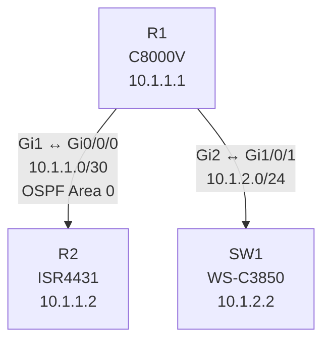

# Example: Network Topology Diagram

## Prompt

```
Discover the network topology from R1 and draw a diagram
```

## What NetClaw Does

NetClaw uses **pyats-topology** to discover neighbors, then **drawio-diagram** to generate the diagram:

### Step 1: CDP Discovery

```
→ pyats_run_show_command: show cdp neighbors detail
```

Extracts per neighbor: device ID, platform, IP address, local interface, remote interface, software version.

### Step 2: LLDP Discovery

```
→ pyats_run_show_command: show lldp neighbors detail
```

Catches non-Cisco devices that CDP misses (Linux hosts, Arista switches, IP phones).

### Step 3: Interface-to-Subnet Mapping

```
→ pyats_run_show_command: show ip interface brief
```

Maps each interface to its IP address and subnet.

### Step 4: Routing Protocol Peers

```
→ pyats_run_show_command: show ip ospf neighbor
→ pyats_run_show_command: show ip bgp summary
```

Adds logical adjacencies (OSPF areas, BGP AS relationships).

### Step 5: Build Topology Model

NetClaw assembles all discovery data into a unified model:

```
Devices Found:
  R1 (C8000V, IOS-XE 17.9.4a) — local device
  R2 (ISR4431, IOS-XE 17.6.3) — via CDP on Gi2
  SW1 (WS-C3850, IOS-XE 16.12.4) — via CDP on Gi3

Links:
  R1:Gi1 ←→ R2:Gi0/0/0  (10.1.1.0/30, OSPF Area 0)
  R1:Gi2 ←→ SW1:Gi1/0/1  (10.1.2.0/24, Access VLAN 10)

Routing:
  R1 ↔ R2: OSPF Area 0 (FULL)
```

### Step 6: Generate Draw.io Diagram

```
→ drawio create_diagram (Mermaid format)
```



The diagram opens in the Draw.io browser editor where it can be edited, exported to PNG/SVG/PDF, or saved.

## Skills Used

- **pyats-topology** (CDP/LLDP discovery, interface mapping, routing peers)
- **pyats-network** (underlying show commands)
- **drawio-diagram** (Mermaid-to-Draw.io rendering)
