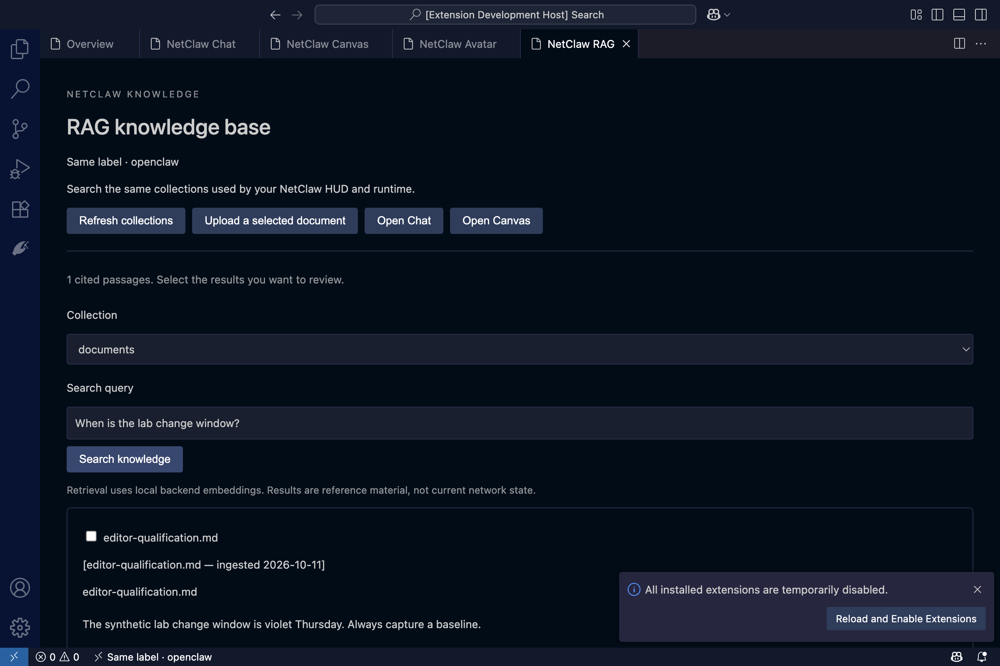
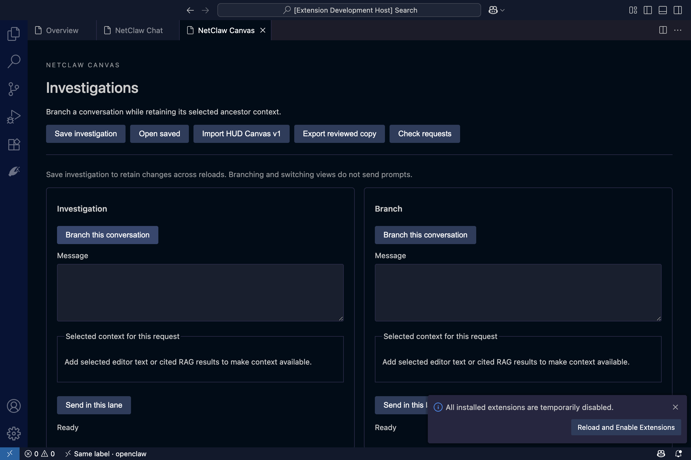

# NetClaw for Visual Studio Code

Manage an existing NetClaw or Risk from the editor. Use the NetClaw Activity Bar
to select an installation, inspect its runtime and integrations, review operations,
and prepare managed changes.

This is a development candidate. Full workflow, platform and Marketplace
qualification is in progress; it is not a published or production-qualified release.

## Workspaces

- **Chat** resumes owned conversations and tracks submitted requests independently of the editor window.
- **Canvas** branches investigations, selects context per lane and imports or exports the existing HUD Canvas format.
- **Avatar** uses the existing local John and lobster assets alongside the same text conversation.
- **RAG knowledge base** browses backend collections, uploads reviewed documents up to 10 MiB, tracks indexing and retrieves cited passages. Selected results become optional Chat or Canvas context. Snapshot age and low-confidence results remain visible.
- **Operations and configuration** expose retained request outcomes, GAIT records and reviewed environment changes.

Screenshots show a controlled Mac test installation. Windows/WSL and Remote SSH
qualification remain required. Assistant natural-language delegation and remaining
federation/security/service controls are still in development; unsupported actions
are refused by the backend.

## Connect

1. Open a trusted desktop VS Code window. For Windows/WSL, first open the intended
   Linux distribution using the WSL extension. Remote SSH windows run beside the backend.
2. Run **NetClaw: Add Connection**. Select the existing harness and absolute paths
   to its runtime home, supported Node executable, and installed
   `scripts/netclaw-operator.mjs` launcher.
3. Review and bind the returned installation identity. Reconnects must match it.

Backend Node requires 24.19–24.x or 26.1+. A stable installation identity and the
management components must already exist. The extension does not install,
upgrade, or repair the backend. Native Windows backend hosting is unsupported.

SSH profiles use existing aliases and strict known-host checking, without agent
forwarding. Restricted Mode permits help and saved labels; it does not connect.

## Privacy and changes

Provider credentials stay in the selected backend `.env`. Environment inventory
shows presence only. Secret replacement is transient and explicit; blank or mask
input keeps the previous value. Preparation records a baseline and redacted intent;
execution must pass the backend's authority, revision, audit and verification checks.

No product telemetry or automatic workspace ingestion is enabled. Diagnostics
are previewed locally before an optional save. Disconnecting or uninstalling the
extension does not stop independently owned NetClaw services.

See [Privacy](PRIVACY.md) for local storage, selected content and model-provider boundaries.

## Development

Use an isolated supported Node toolchain. Run `npm ci`, `npm run check`,
`npm run build`, and `npm run test:editor`. Backend behavioral tests live in
`tests/operator/`. Real WSL and named-client qualification are separate required gates.

The shared HUD package must also have its locked dependencies installed before
building the reused Avatar. `npm run test:package` verifies the exact package
allowlist. `npm run package` builds a development VSIX; it does not publish.

The extension uses the existing NetClaw mobile application logo. Source and support:
[automateyournetwork/netclaw](https://github.com/automateyournetwork/netclaw).
