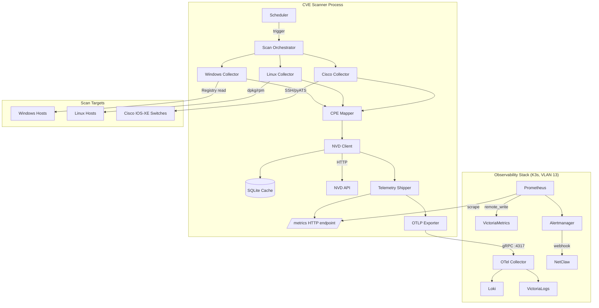

# Design Document: Host CVE Monitoring

## Overview

The Host CVE Monitoring system is a Python-based vulnerability scanner that integrates into the existing Network Guardian observability stack. It discovers installed software/firmware across Windows hosts, Linux hosts, and Cisco IOS-XE switches, maps findings to CPE identifiers, queries the NVD API for matching CVEs, and ships results as both Prometheus metrics and structured logs to the existing OTel Collector → Prometheus/Loki pipeline.

The scanner runs as a long-lived process with periodic scan cycles. On Windows it installs as a Windows Service; on Linux as a systemd unit; in the K3s cluster as a CronJob. All telemetry flows through the existing observability stack — no new infrastructure components are required beyond the scanner itself and its configuration.

### Design Decisions

1. **Single Python package, multi-platform** — one codebase with platform-specific collector plugins, distributed via pip. Avoids maintaining separate projects per OS.
2. **Push metrics via Prometheus /metrics endpoint** — the scanner exposes an HTTP endpoint that Prometheus scrapes, consistent with the existing exporter pattern (UniFi exporter, Blackbox, etc.). OTLP push is supported as an alternative for environments without Prometheus scrape access.
3. **pyATS for Cisco devices** — reuses the existing testbed.yaml and credential model already proven in the NetClaw stack.
4. **Local CPE mapping dictionary + NVD CPE match API fallback** — a static mapping handles known software (Windows OS, Cisco IOS-XE, common packages), while unknown entries are logged for manual enrichment.
5. **Rate-limited NVD client with local cache** — the NVD API is rate-limited (50 req/30s with key). A SQLite cache avoids re-querying unchanged CPEs within a configurable TTL (default 24h).

## Architecture



### Data Flow

1. **Scheduler** triggers a scan run at the configured interval (default 24h) + initial scan on startup.
2. **Scan Orchestrator** fans out to platform-specific collectors (bounded concurrency).
3. **Collectors** gather software inventory from each target, producing `HostProfile` objects.
4. **CPE Mapper** translates each software entry to a CPE 2.3 string using the mapping dictionary.
5. **NVD Client** queries the NVD API for each CPE (cache-first), extracting CVE details.
6. **Telemetry Shipper** updates Prometheus gauge metrics and emits structured logs via OTLP.
7. **Prometheus** scrapes the /metrics endpoint; alerts fire per the configured rules.
8. **Alertmanager** routes CVE alerts to the NetClaw webhook for autonomous investigation.

## Components and Interfaces

### Package Structure

```
cve-scanner/
├── pyproject.toml
├── src/
│   └── cve_scanner/
│       ├── __init__.py
│       ├── __main__.py              # Entry point (cli + service mode)
│       ├── config.py                # YAML config loader + validation
│       ├── scheduler.py             # Periodic scan scheduling (APScheduler)
│       ├── orchestrator.py          # Fan-out to collectors, aggregation
│       ├── collectors/
│       │   ├── __init__.py
│       │   ├── base.py              # Abstract collector interface
│       │   ├── windows.py           # Windows Registry reader
│       │   ├── linux.py             # dpkg/rpm package lister
│       │   └── cisco.py             # pyATS/SSH show version parser
│       ├── cpe/
│       │   ├── __init__.py
│       │   ├── mapper.py            # CPE mapping logic
│       │   └── mappings.py          # Static mapping dictionary
│       ├── nvd/
│       │   ├── __init__.py
│       │   ├── client.py            # NVD API client with rate limiting
│       │   └── cache.py             # SQLite response cache
│       ├── telemetry/
│       │   ├── __init__.py
│       │   ├── metrics.py           # Prometheus metrics (prometheus_client)
│       │   ├── logs.py              # Structured log emitter (OTLP)
│       │   └── server.py            # HTTP server for /metrics endpoint
│       ├── models.py                # Data classes (HostProfile, SoftwareEntry, CVEFinding)
│       └── service/
│           ├── __init__.py
│           ├── windows_svc.py       # pywin32 Windows Service wrapper
│           └── systemd.py           # Helpers for systemd integration
├── config/
│   ├── cve-scanner.yml.example      # Example configuration
│   └── cpe-mappings.yml             # Default CPE mapping dictionary
├── deploy/
│   ├── cve-scanner.service          # systemd unit file
│   ├── k8s-cronjob.yml              # Kubernetes CronJob manifest
│   └── prometheus-rules.yml         # Alert rules for CVE metrics
├── dashboards/
│   └── cve-overview.json            # Grafana dashboard JSON model
└── tests/
    ├── test_cpe_mapper.py
    ├── test_nvd_client.py
    ├── test_collectors.py
    └── test_telemetry.py
```

### Component Interfaces

```python
# Abstract Collector Interface
class BaseCollector(ABC):
    @abstractmethod
    async def collect(self, target: TargetHost) -> HostProfile:
        """Collect software inventory from a single target host."""
        ...

# CPE Mapper Interface
class CPEMapper:
    def map(self, entry: SoftwareEntry, platform: Platform) -> Optional[str]:
        """Map a software entry to a CPE 2.3 string. Returns None if unmappable."""
        ...
    
    def format_cpe(self, vendor: str, product: str, version: str, part: str = "a") -> str:
        """Build a CPE 2.3 formatted string from components."""
        ...
    
    def parse_cpe(self, cpe_string: str) -> CPEComponents:
        """Parse a CPE 2.3 string back into components."""
        ...

# NVD Client Interface
class NVDClient:
    async def query_cves(self, cpe: str) -> list[CVERecord]:
        """Query NVD for CVEs matching a CPE. Handles rate limiting and retries."""
        ...

# Telemetry Shipper Interface
class TelemetryShipper:
    def update_metrics(self, scan_results: list[ScanResult]) -> None:
        """Update Prometheus gauge metrics from scan results."""
        ...
    
    async def emit_logs(self, findings: list[CVEFinding]) -> None:
        """Emit structured logs for each CVE finding via OTLP."""
        ...
```

### Platform-Specific Collectors

**Windows Collector** (`collectors/windows.py`):
- Reads `HKLM\SOFTWARE\Microsoft\Windows\CurrentVersion\Uninstall` and `Wow6432Node` equivalent via `winreg` stdlib module.
- Extracts: `DisplayName`, `Publisher`, `DisplayVersion` for each subkey.
- Collects OS info from `HKLM\SOFTWARE\Microsoft\Windows NT\CurrentVersion` (ProductName, CurrentBuild, EditionID).
- Runs locally (the scanner process must execute on the Windows host itself).

**Linux Collector** (`collectors/linux.py`):
- Detects package manager: checks for `/usr/bin/dpkg` (Debian/Ubuntu) or `/usr/bin/rpm` (RHEL/CentOS).
- Runs `dpkg-query -W -f '${Package}\t${Version}\t${Architecture}\n'` or `rpm -qa --queryformat '%{NAME}\t%{VERSION}-%{RELEASE}\t%{ARCH}\n'`.
- Collects OS info from `/etc/os-release` and `uname -r` for kernel version.
- Runs locally on the Linux host.

**Cisco Collector** (`collectors/cisco.py`):
- Loads the pyATS testbed from the configured path.
- Connects via SSH to each IOS-XE device, runs `show version`.
- Parses structured output (pyATS Genie parser) to extract: software version, hardware model, serial number.
- Retrieves hostname from the parsed output or `show running-config | include hostname`.
- Can run from any host with network access to the switches (typically the K3s cluster or the management host).

## Data Models

```python
from dataclasses import dataclass, field
from enum import Enum
from typing import Optional
import datetime

class Platform(Enum):
    WINDOWS = "windows"
    LINUX = "linux"
    IOSXE = "iosxe"

class Severity(Enum):
    CRITICAL = "critical"
    HIGH = "high"
    MEDIUM = "medium"
    LOW = "low"
    NONE = "none"

@dataclass
class TargetHost:
    hostname: str
    platform: Platform
    address: Optional[str] = None          # IP or hostname for remote targets
    testbed_device: Optional[str] = None   # pyATS device name for Cisco targets

@dataclass
class SoftwareEntry:
    name: str
    version: str
    publisher: Optional[str] = None
    architecture: Optional[str] = None

@dataclass
class HostProfile:
    hostname: str
    platform: Platform
    os_version: str
    collected_at: datetime.datetime
    software: list[SoftwareEntry] = field(default_factory=list)
    # Platform-specific metadata
    os_build: Optional[str] = None         # Windows build number
    os_edition: Optional[str] = None       # Windows edition
    kernel_version: Optional[str] = None   # Linux kernel
    hardware_model: Optional[str] = None   # Cisco model
    serial_number: Optional[str] = None    # Cisco serial

@dataclass
class CPEComponents:
    part: str        # a (application), o (OS), h (hardware)
    vendor: str
    product: str
    version: str
    update: str = "*"
    edition: str = "*"
    language: str = "*"
    sw_edition: str = "*"
    target_sw: str = "*"
    target_hw: str = "*"
    other: str = "*"

@dataclass
class CVERecord:
    cve_id: str
    cvss_score: float
    severity: Severity
    description: str

@dataclass
class CVEFinding:
    host: str
    platform: Platform
    software_name: str
    software_version: str
    cpe: str
    cve_id: str
    cvss_score: float
    severity: Severity
    description: str
    found_at: datetime.datetime

@dataclass
class ScanResult:
    host: str
    platform: Platform
    findings: list[CVEFinding] = field(default_factory=list)
    errors: list[str] = field(default_factory=list)
    scan_started: Optional[datetime.datetime] = None
    scan_completed: Optional[datetime.datetime] = None
```

### Configuration Schema (YAML)

```yaml
# cve-scanner.yml
scanner:
  scan_interval_hours: 24
  initial_scan_delay_seconds: 30
  concurrency: 5
  cache_ttl_hours: 24

targets:
  - hostname: "workstation-01"
    platform: windows
  - hostname: "k3s-server-1"
    platform: linux
    address: "192.168.13.2"
  - hostname: "HomeSwitch01"
    platform: iosxe
    testbed_device: "HomeSwitch01"

cisco:
  testbed_path: "/home/ubuntu/netclaw/testbed/testbed.yaml"

nvd:
  api_key_env: "NVD_API_KEY"
  rate_limit_requests: 50
  rate_limit_window_seconds: 30
  max_retries: 3
  retry_base_delay_seconds: 2

telemetry:
  metrics:
    enabled: true
    port: 9800
    path: "/metrics"
  otlp:
    enabled: true
    endpoint: "192.168.13.202:4317"
    insecure: true
  service_name: "cve-scanner"

cpe_mappings_path: "/etc/cve-scanner/cpe-mappings.yml"

logging:
  level: "INFO"
  format: "json"
```

### CPE Mapping Dictionary Structure

```yaml
# cpe-mappings.yml
# Static mapping: software name patterns → CPE vendor:product
windows_software:
  - pattern: "Google Chrome"
    vendor: "google"
    product: "chrome"
    part: "a"
  - pattern: "Mozilla Firefox"
    vendor: "mozilla"
    product: "firefox"
    part: "a"
  - pattern: "Microsoft Visual C++"
    vendor: "microsoft"
    product: "visual_c%2B%2B"
    part: "a"
  - pattern: "7-Zip"
    vendor: "7-zip"
    product: "7-zip"
    part: "a"

linux_packages:
  - pattern: "openssl"
    vendor: "openssl"
    product: "openssl"
    part: "a"
  - pattern: "openssh-server"
    vendor: "openbsd"
    product: "openssh"
    part: "a"
  - pattern: "nginx"
    vendor: "f5"
    product: "nginx"
    part: "a"
  - pattern: "apache2"
    vendor: "apache"
    product: "http_server"
    part: "a"

cisco_iosxe:
  vendor: "cisco"
  product: "ios_xe"
  part: "o"

windows_os:
  vendor: "microsoft"
  # product derived from edition: windows_10, windows_11, windows_server_2019, etc.
  part: "o"
```

## NVD API Client Design

The NVD client implements:

1. **Token-bucket rate limiter** — allows 50 requests per 30-second window (with API key). Uses `asyncio` semaphore + sliding window counter.
2. **Exponential backoff retry** — on 4xx/5xx responses, retries up to 3 times with delays of 2s, 4s, 8s.
3. **SQLite cache** — keyed by CPE string, stores the full JSON response with a TTL. Avoids re-querying identical CPEs within the cache window.
4. **Graceful degradation** — if all retries fail for a CPE, the error is logged, a `cve_scan_errors_total` metric is incremented, and the scan continues with remaining CPEs.

```python
# Rate limiter pseudocode
class RateLimiter:
    def __init__(self, max_requests: int = 50, window_seconds: int = 30):
        self.max_requests = max_requests
        self.window_seconds = window_seconds
        self.timestamps: deque = deque()
        self.lock = asyncio.Lock()

    async def acquire(self):
        async with self.lock:
            now = time.monotonic()
            # Purge timestamps outside window
            while self.timestamps and now - self.timestamps[0] > self.window_seconds:
                self.timestamps.popleft()
            if len(self.timestamps) >= self.max_requests:
                sleep_time = self.window_seconds - (now - self.timestamps[0])
                await asyncio.sleep(sleep_time)
            self.timestamps.append(time.monotonic())
```

## Deployment Models

### Windows Service

```
cve-scanner installed via pip → pywin32 service wrapper
- Service Name: CVEScanner
- Startup Type: Automatic
- Runs as: Local System (needs Registry read access)
- Config: C:\ProgramData\cve-scanner\cve-scanner.yml
- Logs: Windows Event Log + OTLP to OTel Collector
- Metrics: Exposes :9800/metrics (Prometheus scrapes across VLAN)
```

### Linux systemd

```ini
# /etc/systemd/system/cve-scanner.service
[Unit]
Description=CVE Scanner - Host Vulnerability Monitor
After=network-online.target
Wants=network-online.target

[Service]
Type=simple
User=cve-scanner
ExecStart=/opt/cve-scanner/venv/bin/python -m cve_scanner --config /etc/cve-scanner/cve-scanner.yml
Restart=on-failure
RestartSec=30
Environment=NVD_API_KEY=<injected-from-env-file>
EnvironmentFile=-/etc/cve-scanner/env

[Install]
WantedBy=multi-user.target
```

### Kubernetes CronJob (for Cisco-only scanning from the cluster)

```yaml
apiVersion: batch/v1
kind: CronJob
metadata:
  name: cve-scanner
  namespace: observability
spec:
  schedule: "0 2 * * *"   # Daily at 2am
  jobTemplate:
    spec:
      template:
        spec:
          containers:
          - name: cve-scanner
            image: ghcr.io/byrn-baker/cve-scanner:latest
            args: ["--config", "/etc/cve-scanner/config.yml", "--once"]
            env:
            - name: NVD_API_KEY
              valueFrom:
                secretKeyRef:
                  name: cve-scanner-secret
                  key: nvd-api-key
            volumeMounts:
            - name: config
              mountPath: /etc/cve-scanner
            - name: testbed
              mountPath: /etc/pyats
          volumes:
          - name: config
            configMap:
              name: cve-scanner-config
          - name: testbed
            secret:
              secretName: pyats-testbed
          restartPolicy: OnFailure
```

## Integration with Existing OBS Stack

### Prometheus Scrape Config Addition

Added to `k8s/observability/prometheus.yml`:

```yaml
- job_name: 'cve_scanner'
  scrape_interval: 60s
  static_configs:
    - targets: ['cve-scanner:9800']
      labels:
        service: 'network-guardian'
```

For Windows/Linux hosts running the scanner externally, add them as file-based service discovery or static targets pointing to `<host_ip>:9800`.

### Alert Rules

Added to `k8s/observability/prometheus-alerts.yml` under the `network-guardian.rules.yml` data key:

```yaml
- alert: HostCriticalCVE
  expr: cve_host_vulnerability_count{severity="critical"} > 0
  for: 5m
  labels:
    service: network-guardian
    severity: critical
  annotations:
    summary: "Critical CVE found on {{ $labels.host }}"
    description: "{{ $value }} critical vulnerabilities on {{ $labels.host }} ({{ $labels.platform }})"

- alert: HostHighCVE
  expr: cve_host_vulnerability_count{severity="high"} > 5
  for: 10m
  labels:
    service: network-guardian
    severity: warning
  annotations:
    summary: "Multiple high-severity CVEs on {{ $labels.host }}"
    description: "{{ $value }} high-severity vulnerabilities on {{ $labels.host }}"

- alert: CVEScanStale
  expr: time() - cve_scan_last_success_timestamp > 172800
  for: 5m
  labels:
    service: network-guardian
    severity: warning
  annotations:
    summary: "CVE scan stale for {{ $labels.host }}"
    description: "No successful CVE scan for {{ $labels.host }} in 48+ hours"
```

### Grafana Dashboard

The dashboard JSON model (`dashboards/cve-overview.json`) includes:

1. **Summary row** — total CVEs by severity (stat panels: critical, high, medium, low)
2. **Per-host breakdown** — bar chart of CVE counts by host, stacked by severity
3. **Highest CVSS scores** — table panel sorted by `cve_host_highest_cvss` descending
4. **Scan freshness** — time-since panel showing last successful scan per host
5. **CVE timeline** — graph panel from Loki query showing CVE discoveries over 30 days
6. **CVE detail table** — Loki log panel showing individual findings (host, software, CVE ID, CVSS, severity)

Datasources: uses the existing `Prometheus` and `Loki` datasource names already configured in the stack.


## Correctness Properties

*A property is a characteristic or behavior that should hold true across all valid executions of a system — essentially, a formal statement about what the system should do. Properties serve as the bridge between human-readable specifications and machine-verifiable correctness guarantees.*

### Property 1: Windows Software Entry Completeness

*For any* Windows Registry data containing Uninstall subkeys with DisplayName values, the Windows collector SHALL produce SoftwareEntry objects where every entry has a non-empty `name` field and a `version` field (which may be empty string if the registry key lacks DisplayVersion, but must be present).

**Validates: Requirements 1.3**

### Property 2: Linux Package Entry Completeness

*For any* valid dpkg-query or rpm output line containing tab-separated fields, the Linux collector SHALL produce SoftwareEntry objects where every entry has non-empty `name`, `version`, and `architecture` fields.

**Validates: Requirements 2.3**

### Property 3: CPE Round-Trip Preservation

*For any* valid vendor, product, and version string triple (containing only CPE-legal characters), building a CPE 2.3 string via `format_cpe(vendor, product, version)` and then parsing it back via `parse_cpe()` SHALL yield the original vendor, product, and version components unchanged.

**Validates: Requirements 4.1, 4.6**

### Property 4: Unmapped Software Graceful Skip

*For any* SoftwareEntry whose name does not match any pattern in the CPE mapping dictionary, the CPE Mapper SHALL return `None` without raising an exception, and the overall scan SHALL continue without failure.

**Validates: Requirements 4.2**

### Property 5: Cisco IOS-XE CPE Format Correctness

*For any* valid IOS-XE version string (matching the pattern `\d+\.\d+\.\d+[a-zA-Z]*`), the CPE Mapper SHALL produce a string matching `cpe:2.3:o:cisco:ios_xe:<version>:*:*:*:*:*:*:*` where `<version>` equals the input version.

**Validates: Requirements 4.4**

### Property 6: Windows OS CPE Format Correctness

*For any* valid Windows edition and version combination, the CPE Mapper SHALL produce a string matching `cpe:2.3:o:microsoft:windows_<edition>:<version>:*:*:*:*:*:*:*` where edition and version are correctly derived from the input.

**Validates: Requirements 4.5**

### Property 7: NVD Rate Limiter Correctness

*For any* sequence of N API requests (where N > 50), the rate limiter SHALL ensure that within any sliding 30-second window, no more than 50 requests are dispatched.

**Validates: Requirements 5.3**

### Property 8: Retry Exponential Backoff

*For any* sequence of consecutive HTTP error responses (4xx or 5xx) from the NVD API, the client SHALL make at most 3 retry attempts with delays following the pattern 2^attempt seconds (2s, 4s, 8s), and SHALL not retry after the 3rd failure.

**Validates: Requirements 5.4**

### Property 9: NVD Response Parsing Completeness

*For any* valid NVD API JSON response containing one or more CVE entries with CVSS v3.1 data, the parser SHALL extract a CVERecord with non-empty `cve_id`, numeric `cvss_score` in [0.0, 10.0], valid `severity`, and non-empty `description` for each entry.

**Validates: Requirements 5.6**

### Property 10: Vulnerability Count Metric Accuracy

*For any* ScanResult containing a list of CVEFindings, the `cve_host_vulnerability_count` gauge for each (host, severity, platform) label combination SHALL equal the count of findings matching that severity for that host.

**Validates: Requirements 6.1**

### Property 11: Highest CVSS Metric Invariant

*For any* non-empty list of CVEFindings for a given host, the `cve_host_highest_cvss` gauge SHALL equal the maximum `cvss_score` value among all findings for that host. For an empty findings list, the gauge SHALL be 0.

**Validates: Requirements 6.2**

### Property 12: Structured Log Field Completeness

*For any* CVEFinding object, the emitted structured log entry SHALL contain all of: host, platform, software_name, software_version, cpe, cve_id, cvss_score, severity, and description as non-null fields.

**Validates: Requirements 7.1**

### Property 13: Service Name Attribute Invariant

*For any* structured log entry emitted by the Telemetry Shipper, the resource attribute `service_name` SHALL equal the string `"cve-scanner"`.

**Validates: Requirements 7.3**

### Property 14: Concurrency Limit Enforcement

*For any* set of N target hosts and concurrency limit C, the scan orchestrator SHALL never execute more than C collector tasks simultaneously, regardless of N.

**Validates: Requirements 9.4**

## Error Handling

| Scenario | Behavior | Recovery |
|----------|----------|----------|
| Windows Registry key not found | Log at WARNING, skip that registry path | Continue with available paths |
| Linux package manager not found | Log at ERROR, return empty HostProfile with error | Mark host scan as failed |
| Cisco SSH connection failure | Log at ERROR, increment `cve_scan_errors_total` | Skip device, continue with others |
| pyATS testbed file missing | Fail startup with clear error message | Operator must fix config |
| CPE mapping miss | Log at DEBUG, skip entry | Continue with other software entries |
| NVD API rate limit (429) | Respect Retry-After header, pause all requests | Resume after delay |
| NVD API server error (5xx) | Retry up to 3 times with exponential backoff | If all fail, log + skip CPE |
| NVD API auth failure (401/403) | Log at CRITICAL, halt NVD queries for this scan | Alert operator — bad API key |
| NVD response parse error | Log at WARNING with raw response | Skip that CPE, continue |
| OTLP endpoint unreachable | Buffer logs in memory (up to 1000), retry | Metrics still served via /metrics |
| Config file invalid YAML | Fail startup with validation error | Operator must fix config |
| Scan timeout (single host) | Cancel after configurable timeout (default 5min) | Log error, continue with others |

### Graceful Degradation Hierarchy

1. **Individual software entry fails CPE mapping** → skip entry, log DEBUG
2. **Individual CPE fails NVD lookup** → skip CVE check for that CPE, log WARNING, increment error metric
3. **Entire host scan fails** → log ERROR, increment error metric, continue with other hosts
4. **NVD API completely unavailable** → complete inventory collection, report 0 CVEs, set scan error metric, alert via `CVEScanStale`
5. **Telemetry export fails** → metrics still served on /metrics endpoint; OTLP logs buffered and retried

## Testing Strategy

### Unit Tests (pytest)

Focus on specific examples and edge cases:

- Config loading with valid/invalid YAML
- Registry data parsing with known fixture data (Windows)
- dpkg/rpm output parsing with known fixture data (Linux)
- pyATS show version output parsing with known fixture data (Cisco)
- CPE mapping with specific known software → CPE mappings
- NVD response parsing with real-world example API responses
- Metric value calculations with known input data
- Error handling paths (connection failures, invalid data, timeouts)

### Property-Based Tests (Hypothesis)

The project uses **Hypothesis** (Python PBT library) for property-based testing. Each property test runs a minimum of 100 iterations.

Configuration:
```python
from hypothesis import settings, given

@settings(max_examples=200)
```

Each test is tagged with a comment referencing its design property:
```python
# Feature: host-cve-monitoring, Property 3: CPE round-trip preservation
```

Property tests cover Properties 1–14 as defined in the Correctness Properties section above. Key generators needed:

- `SoftwareEntry` generator (random names, versions, publishers)
- `CVEFinding` generator (random CVE IDs, CVSS scores 0.0–10.0, severities)
- `HostProfile` generator (random hostnames, platforms, software lists)
- CPE component generator (valid vendor/product/version strings with CPE-legal characters)
- NVD API response JSON generator (valid response structures)
- IOS-XE version string generator (e.g., `17.6.3`, `17.9.1a`)
- Windows edition/version generator (e.g., `10`/`22H2`, `server_2019`/`1809`)

### Integration Tests

- End-to-end scan of a mocked Windows host (mocked winreg)
- End-to-end scan of a mocked Linux host (mocked subprocess)
- End-to-end scan with mocked pyATS connection
- NVD API client against recorded responses (VCR/responses library)
- Metrics endpoint serves valid Prometheus exposition format
- OTLP log export against a local mock collector

### CI Pipeline

```
pytest tests/ --cov=cve_scanner --cov-report=term-missing
  ├── tests/unit/           # Fast unit tests
  ├── tests/property/       # Hypothesis property tests (slower, 200 examples each)
  └── tests/integration/    # Mocked integration tests
```

Runs on Python 3.10, 3.11, 3.12 across Ubuntu (Linux tests) and optionally Windows (Windows-specific tests).
